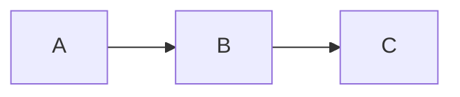

# DevVault

Biblioteca pessoal de conhecimento técnico com conteúdos sobre desenvolvimento de software, arquitetura, cloud, mensageria, banco de dados e muito mais.

## Stack

- **Framework:** Next.js 16 (App Router, SSG)
- **Linguagem:** TypeScript
- **Estilização:** Tailwind CSS v4
- **Conteúdo:** MDX com gray-matter + next-mdx-remote
- **Fontes:** Geist (Sans + Mono) via next/font
- **Diagramas:** Mermaid (client-side)
- **OG Images:** next/og (Edge Runtime)

## Funcionalidades

### 📄 Conteúdo

- 14 categorias: Backend, Frontend, Banco de Dados, DevOps, Arquitetura, Carreira, Cloud, System Design, Design Patterns, SOLID, Resiliência, OKRs, Mensageria
- 52 artigos em MDX com geração estática (SSG)
- Frontmatter com título, descrição, tags, data, layout, tema e template
- Sitemap e RSS feed automáticos
- Página de busca com filtro por texto

### 🎨 Personalização por artigo

Cada artigo pode definir no frontmatter:

```yaml
layout: reading        # default | full-width | reading
theme: violet          # violet | blue | emerald | amber | rose | cyan | orange | pink | indigo | red | fuchsia
template: tutorial     # article | tutorial | cheatsheet | reference
```

### 🖌️ Toolbar de personalização (cliente)

Botão flutuante 🎨 no canto inferior direito dos artigos que permite:

- **Layout:** Padrão, Largo, Leitura, Apresentação
- **Tema:** 11 cores de acento + padrão (salvo no `localStorage`)
- **Tamanho da Fonte:** S / M / L / XL (salvo no `localStorage`)
- **Alto Contraste:** Toggle atalho `C` (salvo no `localStorage`)

### 🎬 Modo Apresentação

Ativado via toolbar ou tecla `P`. Esconde sidebar e TOC, centraliza o conteúdo com fonte maior e fundo mais escuro — ideal para leitura focada ou apresentações.

### ♿ Alto Contraste

Ativado via toolbar ou tecla `C`. Fundo preto, texto branco, links sublinhados e aurora desligada — para leitura em ambientes com pouca luz ou necessidades de acessibilidade.

### ⌨️ Atalhos de teclado

| Tecla | Ação |
|-------|------|
| `/` | Focar na busca |
| `?` | Abrir lista de atalhos |
| `P` | Alternar modo apresentação |
| `C` | Alternar alto contraste |
| `ESC` | Fechar modal / limpar busca |

### 📑 Navegação

- Sidebar fixa com categorias e contadores
- Breadcrumbs em cada artigo
- Tabela de conteúdos lateral com links âncora
- Artigos relacionados por categoria
- Tags clicáveis

### 📊 Diagramas Mermaid

Suporte a diagramas Mermaid em artigos via code blocks com linguagem `mermaid`:

````

````

Renderizado client-side com tema escuro e fallback de erro.

### 🖼️ OG Images Dinâmicas

Cada artigo gera automaticamente uma imagem Open Graph 1200x630 via `/api/og` com:

- Gradiente escuro com cor de acento baseada no tema do artigo
- Badge da categoria
- Título centralizado
- Assinatura DevVault

Usado em compartilhamentos sociais (Twitter, WhatsApp, Discord, LinkedIn).

### 🎯 Extras

- Tema escuro com fundo aurora animado
- Gradientes e animações CSS (sem bibliotecas externas)
- Botão de impressão / PDF
- Skeleton loading (páginas de categoria e artigo)
- Página de busca com filtro por texto

## Estrutura

```
src/
├── app/
│   ├── [category]/[slug]/   # Página do artigo
│   ├── [category]/           # Listagem por categoria
│   ├── api/og/               # OG image dinâmica (Edge)
│   ├── feed.xml/             # RSS feed
│   ├── search/               # Busca global
│   ├── sitemap.ts            # Sitemap
│   ├── globals.css           # Estilos globais + temas + alto contraste
│   ├── layout.tsx            # Layout raiz
│   └── page.tsx              # Home
├── components/
│   ├── layouts/              # LayoutSwitcher, Default, FullWidth, Reading
│   ├── templates/            # TemplateRenderer, TutorialTemplate
│   ├── ArticleToolbar.tsx    # Toolbar de personalização (layout, tema, fonte, contraste)
│   ├── KeyboardShortcuts.tsx # Atalhos de teclado
│   ├── MDXContent.tsx        # Renderizador MDX com suporte a Mermaid
│   ├── MermaidRenderer.tsx   # Renderizador de diagramas Mermaid
│   ├── Sidebar.tsx           # Sidebar de navegação
│   ├── TOC.tsx               # Tabela de conteúdos
│   └── ...                   # Demais componentes
├── lib/
│   ├── content.ts            # Carregador de conteúdo via filesystem
│   ├── types.ts              # Tipos compartilhados
│   └── utils.ts              # Utilitários
content/                      # Artigos MDX organizados por categoria
```

## Como usar

```bash
# Desenvolvimento
npm run dev

# Build
npm run build

# Preview do build
npm run start
```

## Criar novo artigo

1. Crie um arquivo `.mdx` na categoria desejada em `content/`
2. Adicione o frontmatter:

```yaml
---
title: "Título do Artigo"
description: "Descrição curta"
category: "Backend"
tags:
  - Tag1
  - Tag2
featured: true
publishedAt: "2026-06-13"
layout: default
theme: ""
template: article
---
```

3. Escreva o conteúdo em Markdown com suporte a JSX via MDX

## Categorias

| Categoria | Slug | Artigos |
|-----------|------|---------|
| Arquitetura | architecture | 1 |
| Backend | backend | 3 |
| Banco de Dados | database | 2 |
| Carreira | career | 3 |
| Cloud | cloud | 6 |
| Design Patterns | design-patterns | 2 |
| DevOps | devops | 2 |
| Frontend | frontend | 5 |
| Mensageria | mensageria | 4 |
| OKRs | okrs | 1 |
| Princípios SOLID | solid | 5 |
| Resiliência de Sistemas | resiliencia | 4 |
| System Design | system-design | 7 |
| **Total** | | **52** |

---
## Desenvolvido por **Lázaro Vasconcelos**.
