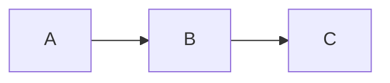

# DevVault

Biblioteca pessoal de conhecimento técnico com conteúdos sobre desenvolvimento de software, arquitetura, cloud, mensageria, banco de dados e muito mais.

## Stack

- **Framework:** Next.js 16 (App Router, SSG + Dynamic)
- **Linguagem:** TypeScript (strict mode)
- **Estilização:** Tailwind CSS v4
- **Conteúdo:** MDX com gray-matter + next-mdx-remote
- **Fontes:** Geist (Sans + Mono) via next/font
- **Busca:** Fuse.js (fuzzy search client-side)
- **Testes:** Vitest + Testing Library
- **Diagramas:** Mermaid (client-side)
- **OG Images:** next/og (Edge Runtime)
- **CI:** GitHub Actions (lint + validação + build)

## Funcionalidades

### 📄 Conteúdo

- **14 categorias:** Arquitetura, Backend, Banco de Dados, Carreira, Cloud, Design Patterns, DevOps, Frontend, Mensageria, OKRs, Princípios SOLID, Resiliência de Sistemas, System Design
- **73 artigos** em MDX
- Frontmatter com título, descrição, tags, data, layout, tema, template, série e draft
- Sitemap e RSS feed automáticos
- Páginas de tag dedicadas (`/tag/[tag]`) com geração estática
- Busca full-text com **Fuse.js** (fuzzy matching, relevância por campo)

### 🏷️ Frontmatter completo

```yaml
---
title: "Título do Artigo"
description: "Descrição curta"
category: "Backend"
tags:
  - Tag1
  - Tag2
featured: true
publishedAt: "2026-06-25"
layout: default          # default | full-width | reading
theme: violet            # violet | blue | emerald | amber | rose | cyan | orange | pink | indigo | red | fuchsia
template: article        # article | tutorial | cheatsheet | reference
series: "Database 101"   # opcional: agrupa artigos em série
seriesOrder: 2           # opcional: ordem dentro da série
draft: false             # opcional: oculta em produção, preview via ?preview=true
---
```

### 🎨 Personalização por artigo

Cada artigo pode definir layout, tema e template no frontmatter. O tema define a cor de acento do gradiente na OG image.

### 🖌️ Toolbar de personalização (cliente)

Botão flutuante 🎨 no canto inferior direito dos artigos que permite:

- **Layout:** Padrão, Largo, Leitura, Apresentação
- **Tema:** 11 cores de acento + padrão (salvo no `localStorage`)
- **Tamanho da Fonte:** S / M / L / XL (salvo no `localStorage`)
- **Alto Contraste:** Toggle atalho `C` (salvo no `localStorage`)

### 🎬 Modo Apresentação

Ativado via toolbar ou tecla `P`. Esconde sidebar e TOC, centraliza o conteúdo com fonte maior e fundo mais escuro — ideal para leitura focada ou apresentações.

### ♿ Alto Contraste

Ativado via toolbar ou tecla `C`. Fundo preto, texto branco, links sublinhados e aurora desligada — para leitura em ambientes com pouca luz ou necessidades de acessibilidade.

### ⌨️ Atalhos de teclado

| Tecla | Ação |
|-------|------|
| `/` | Focar na busca |
| `?` | Abrir lista de atalhos |
| `P` | Alternar modo apresentação |
| `C` | Alternar alto contraste |
| `ESC` | Fechar modal / limpar busca |

### 📑 Navegação

- Sidebar fixa com categorias e contadores
- Breadcrumbs em cada artigo
- Tabela de conteúdos lateral **e colapsável em mobile**
- Artigos relacionados por categoria
- Tags clicáveis com **páginas dedicadas** por tag
- **Navegação entre partes** de uma série (anterior/próximo)

### 🔍 Busca

Busca global com **Fuse.js**:
- Fuzzy matching (tolerância a erros de digitação)
- Pesos por campo (título 3x, descrição 2x, tags 2x, categoria 1x)
- Resultados ordenados por relevância
- Suporte a caracteres acentuados

### 🧩 Séries de Artigos

Artigos podem ser agrupados em séries via frontmatter `series` e `series_order`:
- Navegação entre partes no final do artigo
- Badge "Parte X" no cabeçalho
- JSON-LD com `isPartOf` para SEO

### 📐 Layouts

| Layout | Descrição |
|--------|-----------|
| `default` | Sidebar + artigo + TOC (max-w-6xl) |
| `full-width` | Sidebar + artigo + TOC (max-w-7xl) |
| `reading` | Apenas artigo centralizado (max-w-2xl) |

### 🎯 Templates

| Template | Descrição |
|----------|-----------|
| `article` | Layout de artigo padrão |
| `tutorial` | Passo a passo com dicas visuais |
| `cheatsheet` | Referência rápida |
| `reference` | Documentação técnica |

### 📊 Diagramas Mermaid

Suporte a diagramas Mermaid em artigos via code blocks com linguagem `mermaid`:

````

````

Renderizado client-side com tema escuro, fallback de erro e estado de carregamento.

### 📝 Code Blocks

- **Botão Copiar** em todos os blocos de código (feedback "Copiado!" por 2s)
- Highlight de linguagem via rehype-pretty-code

### 🖼️ OG Images Dinâmicas

Cada artigo gera automaticamente uma imagem Open Graph 1200x630 via `/api/og` com:

- Gradiente escuro com cor de acento baseada no tema do artigo
- Badge da categoria
- Título centralizado
- Assinatura DevVault

Usado em compartilhamentos sociais (Twitter, WhatsApp, Discord, LinkedIn).

### 🔍 SEO

- JSON-LD structured data (`TechArticle` schema org) em todos os artigos
- Metadata dinâmica (Open Graph, Twitter Cards)
- Sitemap XML com todas as páginas (artigos, categorias, tags)
- RSS feed

### 📱 Responsivo

- Sidebar vira drawer em mobile com menu hamburguer
- TOC colapsável em telas pequenas
- Grid de artigos adaptável (2 colunas → 1 coluna)
- Prose responsivo (font-size e spacing ajustados)

### 🖼️ Imagens

Imagens em artigos MDX são otimizadas automaticamente via `next/image`:
- WebP, AVIF, redimensionamento automático
- Lazy loading nativo
- Placeholder blur

### 📦 Draft / Preview

Artigos com `draft: true` no frontmatter:
- Ocultos em produção (não aparecem em listagens nem em páginas estáticas)
- Visualizáveis com `?preview=true` na URL
- Badge "Rascunho — não publicado" visível no preview

### 🧪 Testes

- **Vitest** com jsdom e Testing Library
- Testes de snapshot para componentes chave
- Script: `npm test`

### ✅ CI

GitHub Action automática em push/PR para `main`:
1. `npm ci`
2. `npm run lint`
3. Validação de frontmatter em todos os `.mdx`
4. `npm run build`

### 🎯 Extras

- Tema escuro com fundo aurora animado
- Gradientes e animações CSS (sem bibliotecas externas)
- Botão de impressão / PDF export
- Skeleton loading em páginas de categoria
- Lightbox para imagens em artigos
- Botão Back to Top
- Content cards com view toggle (grid / lista)
- Artigos em destaque (`featured: true`)
- Reading time automático

## Scripts

```bash
npm run dev          # Desenvolvimento
npm run build        # Build de produção
npm run start        # Preview do build
npm run lint         # ESLint
npm test             # Vitest (modo run)
npm run test:watch   # Vitest (modo watch)
npm run validate     # Valida frontmatter de todos os .mdx
```

## Estrutura

```
src/
├── app/
│   ├── [category]/[slug]/   # Página do artigo
│   ├── [category]/           # Listagem por categoria
│   ├── tag/[tag]/            # Listagem por tag
│   ├── api/og/               # OG image dinâmica (Edge)
│   ├── feed.xml/             # RSS feed
│   ├── search/               # Busca global com Fuse.js
│   ├── sitemap.ts            # Sitemap
│   ├── globals.css           # Estilos globais + temas + alto contraste
│   ├── layout.tsx            # Layout raiz
│   └── page.tsx              # Home
├── components/
│   ├── layouts/              # LayoutSwitcher, Default, FullWidth, Reading
│   ├── templates/            # TemplateRenderer, TutorialTemplate
│   ├── __tests__/            # Testes de snapshot
│   ├── ArticleToolbar.tsx    # Toolbar de personalização
│   ├── CodeBlock.tsx         # Code block com botão copiar
│   ├── KeyboardShortcuts.tsx # Atalhos de teclado
│   ├── Lightbox.tsx          # Visualização de imagens em tela cheia
│   ├── MDXContent.tsx        # Renderizador MDX com Image + Mermaid
│   ├── MermaidRenderer.tsx   # Renderizador de diagramas Mermaid
│   ├── Sidebar.tsx           # Sidebar de navegação
│   ├── TagLink.tsx           # Link para página de tag
│   ├── TOC.tsx               # Tabela de conteúdos (desktop + mobile)
│   └── ...                   # Demais componentes
├── lib/
│   ├── content.ts            # Carregador de conteúdo via filesystem
│   ├── types.ts              # Tipos compartilhados
│   └── utils.ts              # Utilitários
content/                      # 73 artigos MDX em 14 categorias
scripts/
└── validate-content.ts       # Validador de frontmatter
.github/
└── workflows/ci.yml          # GitHub Actions
```

## Categorias

| Categoria | Slug | Artigos |
|-----------|------|---------|
| Arquitetura | architecture | 5 |
| Backend | backend | 13 |
| Banco de Dados | database | 5 |
| Carreira | career | 9 |
| Cloud | cloud | 6 |
| Design Patterns | design-patterns | 4 |
| DevOps | devops | 2 |
| Frontend | frontend | 10 |
| Mensageria | mensageria | 4 |
| OKRs | okrs | 2 |
| Princípios SOLID | solid | 5 |
| Resiliência de Sistemas | resiliencia | 5 |
| System Design | system-design | 3 |
| **Total** | | **73** |

---

## Desenvolvido por **Lázaro Vasconcelos**.
