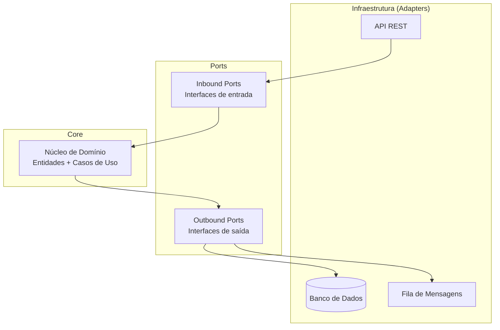
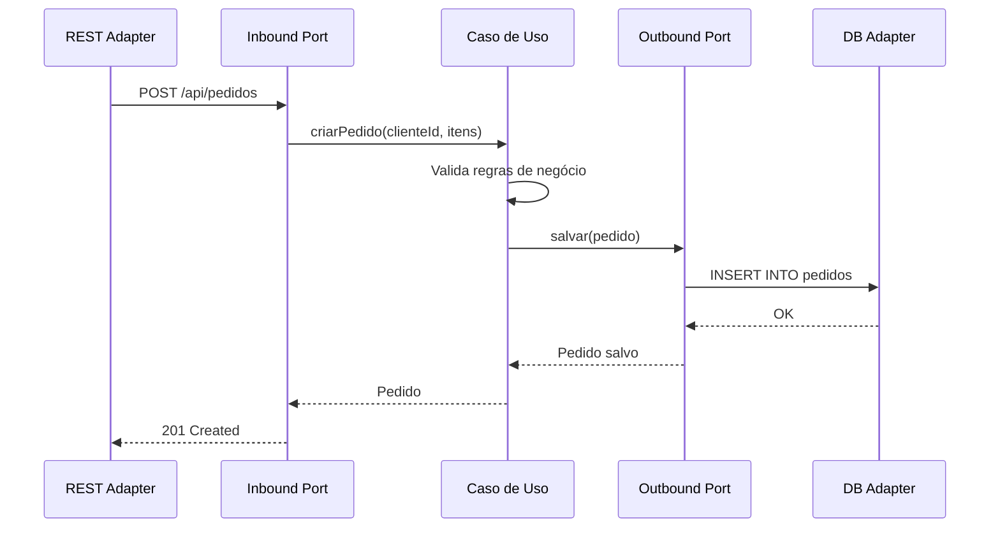

## Introdução

A Arquitetura Hexagonal, também conhecida como Ports and Adapters, foi proposta por Alistair Cockburn com o objetivo de criar aplicações onde o núcleo de domínio é isolado de tecnologias externas como bancos de dados, APIs REST, filas de mensagens e interfaces de usuário.

## Estrutura da Arquitetura



## Camadas

### Núcleo de Domínio (Core)

O centro do hexágono contém as entidades, value objects e casos de uso da aplicação. Esta camada não tem dependências externas — apenas código puro da linguagem.

```java
public class Pedido {
    private final String id;
    private final List<ItemPedido> itens;
    private StatusPedido status;

    public Pedido(String id, List<ItemPedido> itens) {
        this.id = id;
        this.itens = List.copyOf(itens);
        this.status = StatusPedido.PENDENTE;
    }

    public BigDecimal calcularTotal() {
        return itens.stream()
                .map(ItemPedido::getSubtotal)
                .reduce(BigDecimal.ZERO, BigDecimal::add);
    }

    public void confirmar() {
        if (itens.isEmpty()) {
            throw new IllegalStateException("Pedido sem itens não pode ser confirmado");
        }
        this.status = StatusPedido.CONFIRMADO;
    }
}
```

### Ports (Interfaces)

As portas definem contratos entre o domínio e o mundo externo. Existem dois tipos:

**Inbound Ports** — interfaces que expõem funcionalidades do domínio para o mundo externo:

```java
public interface ProcessarPedidoUseCase {
    Pedido criarPedido(String clienteId, List<ItemPedido> itens);
    void confirmarPedido(String pedidoId);
    Optional<Pedido> buscarPorId(String pedidoId);
}
```

**Outbound Ports** — interfaces que o domínio utiliza para acessar recursos externos:

```java
public interface PedidoRepository {
    void salvar(Pedido pedido);
    Optional<Pedido> buscarPorId(String id);
    List<Pedido> listarPorCliente(String clienteId);
}
```

### Adapters (Adaptadores)

Os adaptadores implementam as portas usando tecnologias específicas. Eles são substituíveis sem impacto no domínio.

```java
@Repository
public class PedidoRepositoryJpa implements PedidoRepository {

    private final JpaPedidoRepository jpaRepository;

    public PedidoRepositoryJpa(JpaPedidoRepository jpaRepository) {
        this.jpaRepository = jpaRepository;
    }

    @Override
    public void salvar(Pedido pedido) {
        jpaRepository.save(PedidoEntity.fromDomain(pedido));
    }

    @Override
    public Optional<Pedido> buscarPorId(String id) {
        return jpaRepository.findById(id)
                .map(PedidoEntity::toDomain);
    }

    @Override
    public List<Pedido> listarPorCliente(String clienteId) {
        return jpaRepository.findByClienteId(clienteId)
                .stream()
                .map(PedidoEntity::toDomain)
                .toList();
    }
}
```

## Fluxo de uma Requisição



## Vantagens

- **Domínio isolado** — regras de negócio não vazam para a infraestrutura
- **Testabilidade** — o núcleo pode ser testado sem banco de dados ou servidor HTTP
- **Adaptabilidade** — trocar de banco de dados ou framework não afeta o domínio
- **Manutenibilidade** — dependências apontam para dentro, facilitando mudanças

## Quando Usar

A Arquitetura Hexagonal é recomendada para:

- Aplicações com regras de negócio complexas
- Sistemas que precisam se integrar com múltiplas fontes de dados
- Projetos onde a evolução tecnológica é frequente
- Contextos que utilizam Domain-Driven Design (DDD)

## Conclusão

A Arquitetura Hexagonal promove um design limpo e sustentável ao isolar o núcleo do domínio das preocupações técnicas. Embora exija mais disciplina na organização do código, os benefícios em testabilidade, adaptabilidade e manutenibilidade compensam o investimento em projetos de médio e grande porte.
