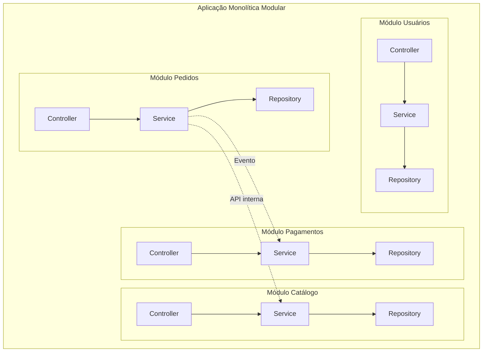

## Introdução

A Arquitetura Monolítica Modular é uma abordagem que organiza um monólito em módulos independentes, cada um representando um bounded context do domínio. Ela combina a simplicidade operacional do monólito com a separação lógica típica de microsserviços, sendo uma excelente alternativa antes de migrar para uma arquitetura distribuída.

## Estrutura de Módulos



## Organização do Projeto

Cada módulo possui suas próprias camadas, encapsulando seu domínio completamente:

```
src/main/java/com/empresa/
├── shared/
│   ├── kernel/
│   │   └── BaseEntity.java
│   └── events/
│       └── DomainEvent.java
├── pedidos/
│   ├── domain/
│   │   ├── Pedido.java
│   │   ├── ItemPedido.java
│   │   └── PedidoRepository.java
│   ├── application/
│   │   ├── CriarPedidoUseCase.java
│   │   └── ConfirmarPedidoUseCase.java
│   └── infra/
│       ├── PedidoController.java
│       └── PedidoRepositoryJpa.java
├── pagamentos/
│   ├── domain/
│   ├── application/
│   └── infra/
└── catalogo/
    ├── domain/
    ├── application/
    └── infra/
```

## Definição de Módulos com Java Modular

O Java 9+ oferece suporte nativo à modularização com o JPMS (Java Platform Module System):

```java
module com.empresa.pedidos {
    exports com.empresa.pedidos.domain;
    exports com.empresa.pedidos.application;

    requires com.empresa.shared;
    requires com.empresa.catalogo;
}
```

```java
module com.empresa.pagamentos {
    exports com.empresa.pagamentos.domain;
    exports com.empresa.pagamentos.application;

    requires com.empresa.shared;
    requires transitive com.empresa.pedidos;
}
```

## Comunicação entre Módulos

### Eventos de Domínio

Módulos se comunicam através de eventos, mantendo baixo acoplamento:

```java
public class PedidoConfirmadoEvent implements DomainEvent {
    private final String pedidoId;
    private final String clienteId;
    private final BigDecimal total;
    private final Instant ocorridoEm;

    // constructor, getters
}
```

```java
@Component
public class PedidoEventHandler {

    @EventListener
    public void handle(PedidoConfirmadoEvent event) {
        // Módulo de Pagamentos processa o evento
        processarPagamento(event);
    }

    @EventListener
    public void handle(PedidoConfirmadoEvent event) {
        // Módulo de Estoque atualiza
        baixarEstoque(event);
    }
}
```

### APIs Internas

Módulos podem expor interfaces para consumo interno de outros módulos:

```java
// Módulo Catálogo expõe para consumo interno
public interface ProdutoConsulta {
    Optional<Produto> buscarPorId(String id);
    boolean temEstoqueDisponivel(String produtoId, int quantidade);
}

// Módulo Pedidos consome
@Service
public class CriarPedidoService {

    private final ProdutoConsulta produtoConsulta;

    public CriarPedidoService(ProdutoConsulta produtoConsulta) {
        this.produtoConsulta = produtoConsulta;
    }

    public Pedido executar(List<ItemRequest> itens) {
        for (ItemRequest item : itens) {
            if (!produtoConsulta.temEstoqueDisponivel(
                    item.produtoId(), item.quantidade())) {
                throw new EstoqueInsuficienteException(item.produtoId());
            }
        }
        // cria o pedido...
    }
}
```

## Vantagens do Monolito Modular

| Aspecto | Monolito Tradicional | Monolito Modular | Microsserviços |
|---------|---------------------|------------------|----------------|
| Deploy | Único | Único | Múltiplos |
| Acoplamento | Alto (qualquer coisa depende de qualquer coisa) | Baixo (apenas via interfaces/eventos) | Baixo (via rede) |
| Complexidade operacional | Baixa | Baixa | Alta |
| Isolamento de domínio | Baixo | Alto | Alto |
| Tempo de desenvolvimento | Rápido inicialmente | Moderado | Lento inicialmente |
| Refatoração para microsserviços | Difícil | Fácil (módulos viram serviços) | N/A |

## Migrando para Microsserviços

Quando o monolito modular atinge seus limites, a migração para microsserviços é natural:

1. Cada módulo já possui seu próprio domínio e banco de dados (schemas separados)
2. A comunicação por eventos pode ser mantida com um message broker
3. As APIs internas se tornam APIs HTTP ou gRPC
4. O deploy pode ser feito um módulo por vez

## Conclusão

A Arquitetura Monolítica Modular oferece o melhor dos dois mundos: a simplicidade operacional de um monólito com a organização e o isolamento de domínios característicos de microsserviços. É uma excelente estratégia inicial para projetos que podem crescer e evoluir para uma arquitetura distribuída no futuro.
