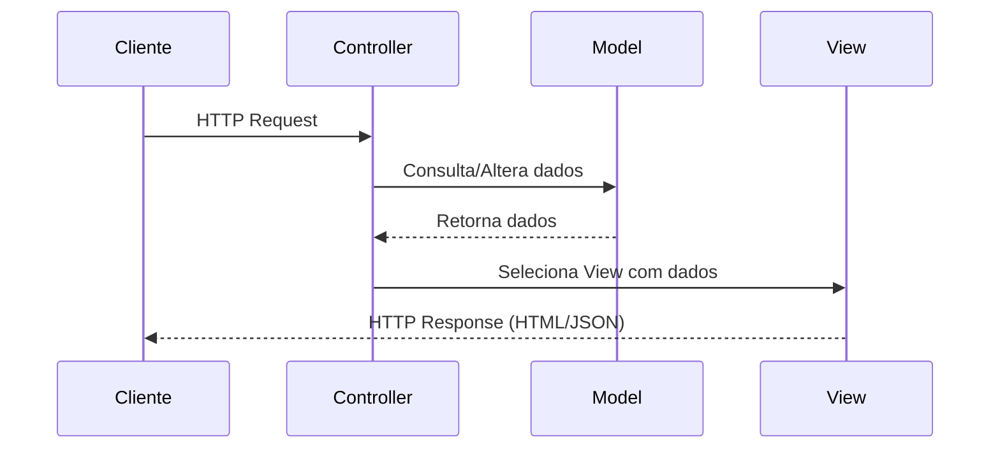

## Introdução

O padrão MVC (Model-View-Controller) é um dos padrões arquiteturais mais difundidos no desenvolvimento de aplicações web. Ele separa a aplicação em três camadas interconectadas, promovendo organização, reutilização de código e facilidade de manutenção.

## Componentes do MVC

### Model

O Model representa os dados da aplicação e as regras de negócio. Ele não conhece a View nem o Controller, sendo completamente desacoplado da camada de apresentação.

```java
@Entity
public class Usuario {
    @Id
    @GeneratedValue(strategy = GenerationType.IDENTITY)
    private Long id;
    private String nome;
    private String email;

    public boolean isEmailValido() {
        return email != null && email.contains("@");
    }
}
```

### View

A View é responsável pela apresentação dos dados ao usuário. Ela observa o Model e se atualiza quando os dados mudam. Em aplicações web modernas, pode ser renderizada no servidor (Thymeleaf, JSP) ou no cliente (React, Angular).

> **⚠️ Regra importante:** Nunca coloque regras de negócio na View. Validações, cálculos e lógica do domínio pertencem ao Model ou à camada de serviço — a View deve apenas exibir dados já processados. Muitas IAs generativas cometem esse erro ao gerar código, inserindo validações e regras diretamente no template ou componente visual. Isso fere o princípio de separação de responsabilidades e pode expor lógica sensível ao usuário.

### Controller

O Controller recebe as requisições do usuário, executa a lógica necessária (consultando ou atualizando o Model) e retorna a View apropriada.

```java
@RestController
@RequestMapping("/api/usuarios")
public class UsuarioController {

    private final UsuarioService service;

    public UsuarioController(UsuarioService service) {
        this.service = service;
    }

    @GetMapping
    public ResponseEntity<List<Usuario>> listar() {
        return ResponseEntity.ok(service.listarTodos());
    }

    @PostMapping
    public ResponseEntity<Usuario> criar(@RequestBody Usuario usuario) {
        return ResponseEntity.status(201).body(service.salvar(usuario));
    }
}
```

## Fluxo de Requisição



## Vantagens e Desvantagens

| Aspecto | Vantagem | Desvantagem |
|---------|----------|-------------|
| Separação | Código organizado em camadas | Pode adicionar complexidade inicial |
| Testabilidade | Cada camada testável isoladamente | Requer mocking das dependências |
| Reutilização | Models podem ser usados em múltiplas views | Controllers podem ficar "gordos" |
| Manutenção | Alterações na View não afetam o Model | Fluxo de navegação pode ficar espalhado |

## Implementação com Spring Boot

No ecossistema Spring, o MVC é implementado de forma nativa com o módulo Spring Web MVC:

- **@Controller / @RestController** — define os Controllers
- **@Service** — camada de serviço (lógica de negócio)
- **@Repository** — acesso a dados (Model)
- **Thymeleaf ou React** — camada de View

```java
@Service
public class UsuarioService {

    private final UsuarioRepository repository;

    public UsuarioService(UsuarioRepository repository) {
        this.repository = repository;
    }

    public List<Usuario> listarTodos() {
        return repository.findAll();
    }

    public Usuario salvar(Usuario usuario) {
        if (!usuario.isEmailValido()) {
            throw new IllegalArgumentException("Email inválido");
        }
        return repository.save(usuario);
    }
}
```

## Conclusão

O MVC é um padrão maduro e amplamente adotado que organiza aplicações em três responsabilidades distintas. Frameworks como Spring Boot tornam sua implementação simples e produtiva, sendo uma excelente escolha para aplicações web de todos os portes.
