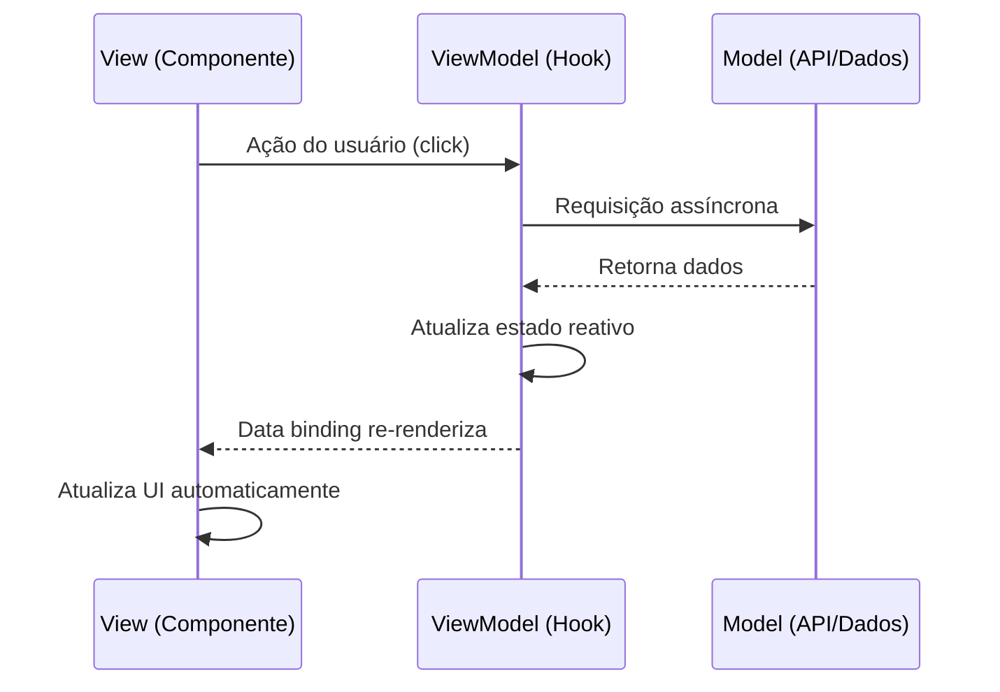

## Introdução

O padrão MVVM (Model-View-ViewModel) surgiu para facilitar a separação entre a lógica de apresentação e a interface do usuário, especialmente em aplicações com interfaces ricas e reatividade. Ele é amplamente utilizado em frameworks como WPF, Angular, Vue.js e, com adaptações, no React.

## Componentes do MVVM

### Model

Assim como no MVC, o Model representa os dados da aplicação e as regras de negócio. Ele é independente da interface do usuário e pode ser testado isoladamente.

### View

A View é a camada visual, responsável por exibir os dados e capturar interações do usuário. No MVVM, a View é "passiva" — ela reage a mudanças no ViewModel por meio de data binding.

### ViewModel

O ViewModel é o coração do padrão. Ele expõe os dados do Model em um formato adequado para a View, gerencia o estado da interface e responde a comandos do usuário. Diferente do Controller no MVC, o ViewModel não conhece a View diretamente — a comunicação ocorre via binding.

## MVVM com React

No React, o MVVM pode ser implementado combinando hooks de estado com componentes puramente visuais:

```typescript
interface Usuario {
  id: number;
  nome: string;
  email: string;
}

function useUsuarioViewModel() {
  const [usuarios, setUsuarios] = useState<Usuario[]>([]);
  const [carregando, setCarregando] = useState(false);

  const listar = useCallback(async () => {
    setCarregando(true);
    try {
      const response = await fetch("/api/usuarios");
      const data = await response.json();
      setUsuarios(data);
    } finally {
      setCarregando(false);
    }
  }, []);

  return { usuarios, carregando, listar };
}
```

```typescript
function UsuarioView() {
  const { usuarios, carregando, listar } = useUsuarioViewModel();

  useEffect(() => { listar(); }, [listar]);

  if (carregando) return <p>Carregando...</p>;

  return (
    <ul>
      {usuarios.map((u) => (
        <li key={u.id}>{u.nome} - {u.email}</li>
      ))}
    </ul>
  );
}
```

## Fluxo de Dados



## MVVM vs MVC

| Aspecto | MVC | MVVM |
|---------|-----|------|
| Comunicação | Controller manipula View diretamente | ViewModel expõe dados via binding |
| Testabilidade da View | Requer ferramentas de UI | View é passiva e testável via ViewModel |
| Estado | Gerenciado no Controller | Gerenciado no ViewModel com reatividade |
| Complexidade | Menor para apps simples | Melhor para UIs complexas e ricas |
| Frameworks | Spring MVC, Rails, Django | Angular, Vue.js, React (adaptado) |

## Data Binding Bidirecional

No Vue.js, o two-way data binding é nativo com `v-model`:

```html
<template>
  <div>
    <input v-model="nome" placeholder="Digite seu nome" />
    <p>Olá, {{ nome }}!</p>
  </div>
</template>

<script>
export default {
  data() {
    return { nome: "" };
  },
};
</script>
```

## Boas Práticas

- **ViewModels enxutos** — cada ViewModel deve ter uma responsabilidade clara
- **Modelos imutáveis** — prefira imutabilidade para facilitar o rastreamento de mudanças
- **Separação de concerns** — não coloque lógica de DOM ou chamadas diretas à API no ViewModel
- **Testes unitários** — o ViewModel é a unidade mais testável do padrão

## Conclusão

O MVVM é uma excelente escolha para aplicações com interfaces dinâmicas e ricas, onde a reatividade e a testabilidade são prioridades. Frameworks modernos como React (com hooks), Vue.js e Angular implementam variações desse padrão, tornando-o acessível e produtivo.
