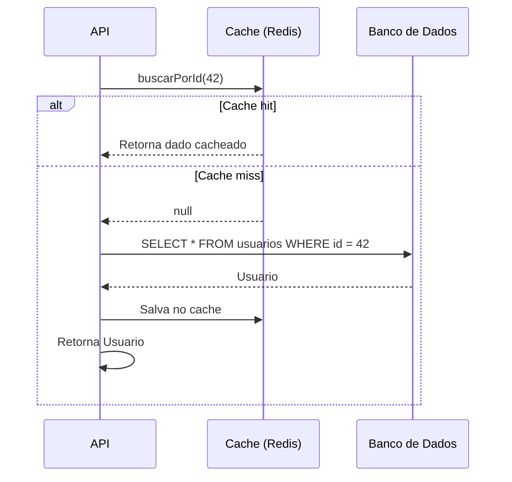

## Introdução

Cache é uma das estratégias mais eficazes para melhorar a performance de aplicações. Com Redis e Spring Cache, é possível adicionar cache distribuído de forma declarativa usando anotações, sem acoplar o código de negócio à infraestrutura de cache.

## Configuração do Redis

Adicione as dependências:

```xml
<dependency>
    <groupId>org.springframework.boot</groupId>
    <artifactId>spring-boot-starter-data-redis</artifactId>
</dependency>
<dependency>
    <groupId>org.springframework.boot</groupId>
    <artifactId>spring-boot-starter-cache</artifactId>
</dependency>
```

Configure a conexão:

```yaml
spring:
  data:
    redis:
      host: localhost
      port: 6379
      timeout: 2000ms
  cache:
    type: redis
    redis:
      time-to-live: 600000
      cache-null-values: false
```

Habilite o cache na aplicação:

```java
@EnableCaching
@SpringBootApplication
public class Application {
    public static void main(String[] args) {
        SpringApplication.run(Application.class, args);
    }
}
```

## Anotações do Spring Cache

### @Cacheable

Armazena o resultado da execução e retorna o valor em cache nas próximas chamadas:

```java
@Cacheable(value = "usuarios", key = "#id")
public Usuario buscarPorId(Long id) {
    return repository.findById(id)
            .orElseThrow(() -> new RecursoNaoEncontradoException("Usuário", id));
}
```

### @CachePut

Atualiza o cache sempre que o método é executado:

```java
@CachePut(value = "usuarios", key = "#usuario.id")
public Usuario atualizar(Usuario usuario) {
    return repository.save(usuario);
}
```

### @CacheEvict

Remove entradas do cache:

```java
@CacheEvict(value = "usuarios", key = "#id")
public void remover(Long id) {
    repository.deleteById(id);
}
```

Para limpar todo o cache de uma região:

```java
@CacheEvict(value = "usuarios", allEntries = true)
public void limparCacheUsuarios() {}
```

## Cache em Múltiplas Camadas



## Estratégias de Invalidação

| Estratégia | Descrição | Quando usar |
|------------|-----------|-------------|
| TTL (Time-to-Live) | Expira após tempo fixo | Dados que mudam com frequência previsível |
| @CacheEvict | Remove ao alterar | Dados que precisam ser consistentes |
| Cache on write | Atualiza ao salvar | Cenários de leitura intensa |
| Cache aside | Aplicação gerencia o cache | Controle manual necessário |

Configurando TTL global:

```java
@Bean
public RedisCacheConfiguration cacheConfiguration() {
    return RedisCacheConfiguration.defaultCacheConfig()
            .entryTtl(Duration.ofMinutes(10))
            .disableCachingNullValues()
            .serializeValuesWith(
                    RedisSerializationContext.SerializationPair
                            .fromSerializer(new GenericJackson2JsonRedisSerializer()));
}
```

## Cache por Usuário ou Contexto

Use chaves complexas com SpEL:

```java
@Cacheable(value = "pedidos", key = "#usuarioId + '-' + #status.name()")
public List<Pedido> listarPorUsuarioEStatus(Long usuarioId, StatusPedido status) {
    return repository.findByUsuarioIdAndStatus(usuarioId, status);
}
```

## Cache de Consultas com Paginação

Cacheie o conteúdo, não a page inteira:

```java
@Cacheable(value = "usuarios-lista", key = "#page + '-' + #size")
public List<Usuario> listarPaginado(int page, int size) {
    Pageable pageable = PageRequest.of(page, size);
    return repository.findAll(pageable).getContent();
}
```

## Monitoramento do Cache

Exponha métricas do Redis para monitoramento:

```java
@Bean
public RedisCacheManager cacheManager(RedisConnectionFactory factory) {
    return RedisCacheManager.builder(factory)
            .cacheDefaults(cacheConfiguration())
            .withInitialCacheConfigurations(Map.of(
                    "usuarios", cacheConfiguration().entryTtl(Duration.ofMinutes(5)),
                    "pedidos", cacheConfiguration().entryTtl(Duration.ofMinutes(30))
            ))
            .build();
}
```

## Boas Práticas

- **Não cacheadados sensíveis** — senhas, tokens e informações pessoais não devem ficar em cache
- **TTL realista** — baseie o TTL na frequência de atualização dos dados
- **Cache de null** — evite cache de valores nulos (a menos que seja intencional)
- **Chaves consistentes** — use um padrão previsível para as chaves
- **Estratégia de fallback** — se o Redis cair, a aplicação deve continuar funcionando
- **Invalidar ao alterar** — sempre use `@CacheEvict` ou `@CachePut` em métodos de escrita

## Conclusão

O Spring Cache com Redis oferece uma forma elegante e declarativa de adicionar cache distribuído à sua aplicação. Com anotações simples como `@Cacheable`, `@CachePut` e `@CacheEvict`, você ganha performance sem poluir o código de negócio com lógica de infraestrutura.
