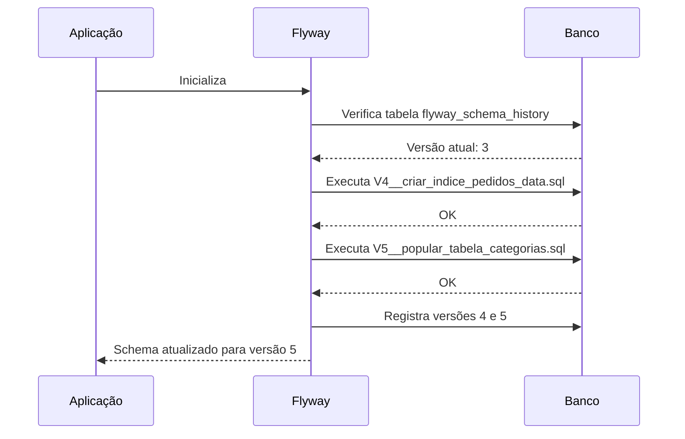

## Introdução

Gerenciar mudanças no schema do banco de dados manualmente é uma receita para desastres. O Flyway versiona cada alteração como uma migração, garantindo que todos os ambientes (dev, staging, produção) estejam sempre sincronizados e reproduzíveis.

## Configuração

Adicione a dependência no `pom.xml`:

```xml
<dependency>
    <groupId>org.flywaydb</groupId>
    <artifactId>flyway-core</artifactId>
</dependency>
<dependency>
    <groupId>org.flywaydb</groupId>
    <artifactId>flyway-database-postgresql</artifactId>
</dependency>
```

Configure no `application.yml`:

```yaml
spring:
  flyway:
    enabled: true
    locations: classpath:db/migration
    baseline-on-migrate: true
    baseline-version: 0
    validate-on-migrate: true
```

## Estrutura de Migrações

As migrações ficam em `src/main/resources/db/migration/` com nomenclatura padronizada:

```
src/main/resources/db/migration/
├── V1__criar_tabela_usuarios.sql
├── V2__criar_tabela_pedidos.sql
├── V3__adicionar_email_unico.sql
├── V4__criar_indice_pedidos_data.sql
└── V5__popular_tabela_categorias.sql
```

### Migração SQL

```sql
-- V1__criar_tabela_usuarios.sql
CREATE TABLE usuarios (
    id BIGSERIAL PRIMARY KEY,
    nome VARCHAR(255) NOT NULL,
    email VARCHAR(255) NOT NULL,
    criado_em TIMESTAMP DEFAULT CURRENT_TIMESTAMP
);

CREATE TABLE pedidos (
    id BIGSERIAL PRIMARY KEY,
    usuario_id BIGINT NOT NULL REFERENCES usuarios(id),
    total DECIMAL(10,2) NOT NULL,
    status VARCHAR(50) NOT NULL DEFAULT 'PENDENTE',
    criado_em TIMESTAMP DEFAULT CURRENT_TIMESTAMP
);
```

```sql
-- V3__adicionar_email_unico.sql
ALTER TABLE usuarios ADD CONSTRAINT uk_usuarios_email UNIQUE (email);
```

## Migrações com Java

Para lógicas mais complexas, use Java-based migrations:

```java
public class V4__popular_tabela_categorias extends BaseJavaMigration {

    @Override
    public void migrate(Context context) throws Exception {
        try (var statement = context.getConnection().createStatement()) {
            for (var categoria : List.of("Java", "Spring", "React", "DevOps")) {
                statement.execute("INSERT INTO categorias (nome) VALUES ('%s')".formatted(categoria));
            }
        }
    }
}
```

## Fluxo de Migração



## Rollback e Reparo

Flyway não oferece rollback automático via SQL (é destrutivo). Estratégias:

- **Migração reversa** — crie uma nova migração que desfaz a anterior:

```sql
-- V6__reverter_email_unico.sql
ALTER TABLE usuarios DROP CONSTRAINT uk_usuarios_email;
```

- **Reparo** — se uma migração falhou no meio:

```bash
# Corrige o schema history manualmente
mvn flyway:repair
```

## Migrações por Ambiente

Use perfis do Spring para migrações específicas:

```yaml
# application-dev.yml
spring:
  flyway:
    locations: classpath:db/migration,classpath:db/seed
```

```
src/main/resources/db/seed/
└── V99__popular_dados_dev.sql
```

## Validação e Integridade

O Flyway valida checksums das migrações executadas:

```yaml
spring:
  flyway:
    validate-on-migrate: true
    validate-migration-naming: true
```

Se alguém alterar uma migração já executada, o Flyway lança um erro — protegendo a integridade do schema.

## Boas Práticas

- **Nunca altere migrações já executadas** — crie uma nova migração
- **Commits frequentes** — uma migração por mudança lógica
- **Nomes descritivos** — `V3__adicionar_email_unico.sql` em vez de `V3__update.sql`
- **Teste as migrações** — use TestContainers para validar em CI/CD
- **Separe seed data** — dados de teste não devem estar nas migrações principais
- **Baseline em projetos existentes** — use `baseline-on-migrate: true` para integrar com banco já existente

## Conclusão

O Flyway traz para o banco de dados o mesmo controle de versão que o Git trouxe para o código. Com migrações versionadas e reproduzíveis, você elimina o "funciona na minha máquina" e garante que todos os ambientes estejam sempre consistentes.
