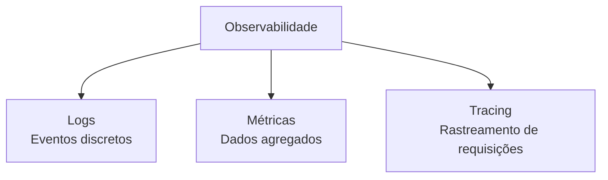

## Introdução

Observabilidade é a capacidade de entender o estado interno de um sistema apenas observando suas saídas — logs, métricas e tracing (os três pilares). Em aplicações Spring Boot, ferramentas como Micrometer, OpenTelemetry e Logback tornam isso prático e padronizado.

## Os Três Pilares



## Logs Estruturados com Logback

Configure o Logback para produzir logs em JSON (mais fáceis de indexar no Elasticsearch ou Datadog):

```xml
<!-- src/main/resources/logback-spring.xml -->
<configuration>
    <appender name="JSON" class="ch.qos.logback.core.ConsoleAppender">
        <encoder class="net.logstash.logback.encoder.LogstashEncoder">
            <includeContext>false</includeContext>
            <customFields>{"application":"devault-api","environment":"${ENV:-dev"}}</customFields>
        </encoder>
    </appender>

    <root level="INFO">
        <appender-ref ref="JSON" />
    </root>
</configuration>
```

Saída:

```json
{
  "@timestamp": "2026-06-24T10:30:00.123Z",
  "level": "INFO",
  "logger": "com.devault.service.UsuarioService",
  "message": "Usuário criado com sucesso",
  "application": "devault-api",
  "environment": "production",
  "usuario_id": 42
}
```

## Correlation IDs

Para rastrear uma requisição através de múltiplos serviços, use correlation IDs:

```java
@Component
public class CorrelationIdFilter implements Filter {

    private static final String CORRELATION_ID_HEADER = "X-Correlation-Id";

    @Override
    public void doFilter(ServletRequest request, ServletResponse response, FilterChain chain) {
        var req = (HttpServletRequest) request;
        var correlationId = req.getHeader(CORRELATION_ID_HEADER);

        if (correlationId == null || correlationId.isBlank()) {
            correlationId = UUID.randomUUID().toString();
        }

        MDC.put("correlationId", correlationId);
        ((HttpServletResponse) response).setHeader(CORRELATION_ID_HEADER, correlationId);
        chain.doFilter(request, response);
        MDC.remove("correlationId");
    }
}
```

## Métricas com Micrometer

O Spring Boot já integra o Micrometer, que coleta métricas automaticamente:

```yaml
management:
  endpoints:
    web:
      exposure:
        include: health,metrics,prometheus
  metrics:
    tags:
      application: devault-api
```

Adicione métricas customizadas:

```java
@Component
public class UsuarioMetrics {

    private final Counter usuariosCriados;
    private final Timer tempoCriacao;

    public UsuarioMetrics(MeterRegistry registry) {
        this.usuariosCriados = Counter.builder("usuarios.criados")
                .description("Total de usuários criados")
                .register(registry);

        this.tempoCriacao = Timer.builder("usuarios.criacao.tempo")
                .description("Tempo de criação de usuário")
                .register(registry);
    }

    public void incrementarCriacao(Runnable acao) {
        tempoCriacao.record(acao);
        usuariosCriados.increment();
    }
}
```

```java
@Service
public class UsuarioService {

    private final UsuarioMetrics metrics;

    public Usuario salvar(Usuario usuario) {
        metrics.incrementarCriacao(() -> {
            // lógica de criação
            return repository.save(usuario);
        });
    }
}
```

## Métricas por Endpoint

O Spring Boot Actuator já expõe métricas HTTP automaticamente:

```bash
curl http://localhost:8080/actuator/metrics/http.server.requests
```

```json
{
  "name": "http.server.requests",
  "measurements": [
    { "statistic": "COUNT", "value": 1542 },
    { "statistic": "TOTAL_TIME", "value": 12.5 },
    { "statistic": "MAX", "value": 0.45 }
  ],
  "availableTags": [
    { "tag": "uri", "values": ["/api/usuarios", "/api/pedidos"] },
    { "tag": "status", "values": ["200", "201", "404", "500"] }
  ]
}
```

## Tracing Distribuído com OpenTelemetry

Adicione tracing para rastrear requisições entre serviços:

```xml
<dependency>
    <groupId>io.opentelemetry</groupId>
    <artifactId>opentelemetry-exporter-otlp</artifactId>
</dependency>
<dependency>
    <groupId>io.opentelemetry.instrumentation</groupId>
    <artifactId>opentelemetry-spring-boot-starter</artifactId>
</dependency>
```

```yaml
otel:
  service:
    name: devault-api
  exporter:
    otlp:
      endpoint: http://jaeger:4317
  traces:
    sampler: parent-based_always_on
```

O OpenTelemetry instrumenta automaticamente:

- Chamadas HTTP (entrada e saída)
- Queries ao banco de dados
- Chamadas a filas de mensagens
- Cache Redis

## Visualizando com Grafana + Prometheus + Jaeger

```yaml
# docker-compose.yml para observabilidade local
services:
  prometheus:
    image: prom/prometheus
    volumes:
      - ./prometheus.yml:/etc/prometheus/prometheus.yml
    ports:
      - "9090:9090"

  grafana:
    image: grafana/grafana
    ports:
      - "3000:3000"

  jaeger:
    image: jaegertracing/all-in-one
    ports:
      - "16686:16686"
      - "4317:4317"
```

## Boas Práticas

- **Logs estruturados** — sempre em JSON, nunca texto puro
- **Níveis corretos** — ERROR para falhas, WARN para situações anormais, INFO para eventos de negócio, DEBUG para desenvolvimento
- **Nunca log dados sensíveis** — senhas, tokens e PII não devem aparecer nos logs
- **Correlation IDs** — toda requisição deve ter um ID único
- **Métricas com tags** — adicione tags (status, endpoint, serviço) para filtrar
- **Amostragem de traces** — não trace 100% das requisições em produção

## Conclusão

Observabilidade não é opcional em sistemas modernos. Com logs estruturados, métricas ricas e tracing distribuído, você consegue diagnosticar problemas, entender o comportamento do sistema e tomar decisões baseadas em dados. O ecossistema Spring Boot oferece suporte nativo para os três pilares, facilitando a implementação.
