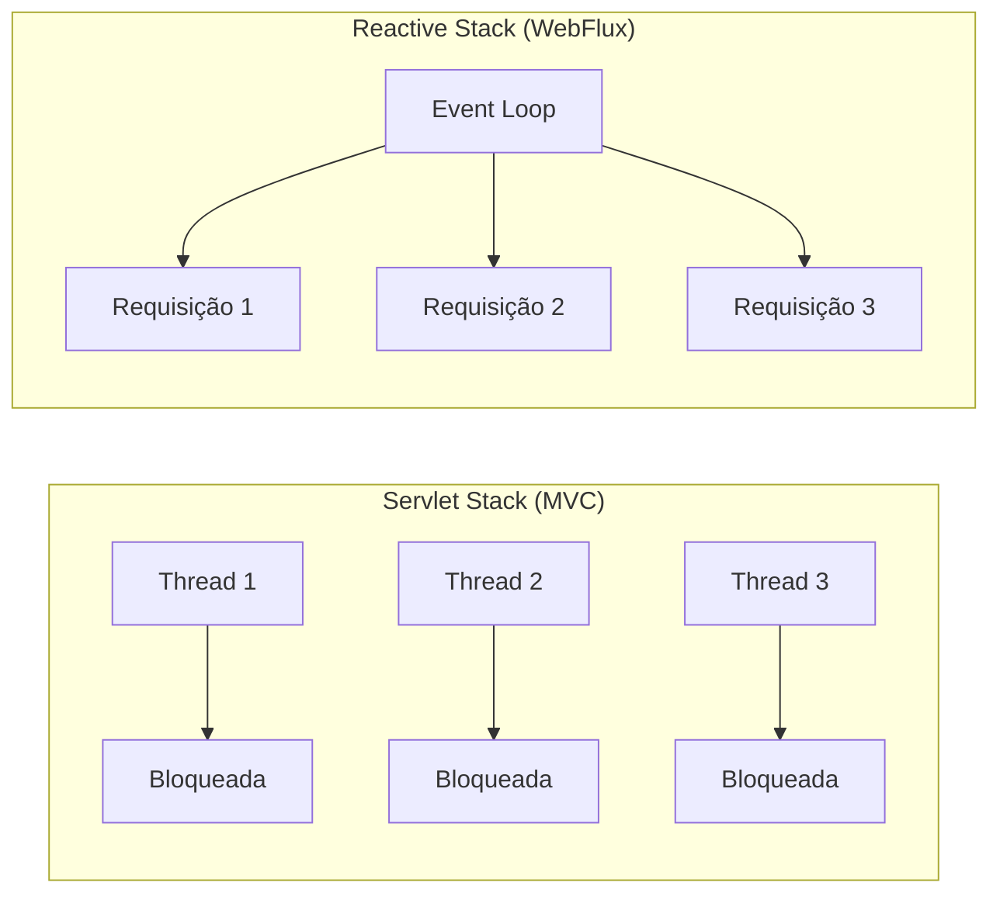

## Introdução

O Spring WebFlux é o módulo reativo do Spring Framework, projetado para aplicações que precisam de alta concorrência com baixo consumo de recursos. Diferente do modelo Servlet tradicional (1 requisição = 1 thread), o WebFlux opera com I/O não-blocante e um número reduzido de threads.

## Modelo Reativo vs Servlet



| Aspecto | Spring MVC | Spring WebFlux |
|---------|-----------|----------------|
| Modelo | 1 thread por requisição | Event loop com threads fixas |
| I/O | Bloqueante | Não-blocante |
| Escalabilidade | Limitada por threads | Alta com poucos recursos |
| Tipos de retorno | `ResponseEntity`, `ModelAndView` | `Mono<T>`, `Flux<T>` |
| Banco de dados | JDBC, JPA (bloqueante) | R2DBC, MongoDB reativo |

## Mono e Flux

Os dois tipos fundamentais do Reactor:

- **`Mono<T>`** — representa 0 ou 1 elemento
- **`Flux<T>`** — representa 0 ou N elementos

```java
@RestController
@RequestMapping("/api/usuarios")
public class UsuarioReactiveController {

    @GetMapping("/{id}")
    public Mono<ResponseEntity<Usuario>> buscar(@PathVariable Long id) {
        return service.buscarPorId(id)
                .map(ResponseEntity::ok)
                .defaultIfEmpty(ResponseEntity.notFound().build());
    }

    @GetMapping
    public Flux<Usuario> listar() {
        return service.listarTodos();
    }

    @PostMapping
    public Mono<ResponseEntity<Usuario>> criar(@RequestBody Usuario usuario) {
        return service.salvar(usuario)
                .map(u -> ResponseEntity.status(201).body(u));
    }
}
```

## Operadores Reativos

O Reactor oferece dezenas de operadores para transformar, filtrar e combinar fluxos:

```java
@Service
public class UsuarioReactiveService {

    private final UsuarioReactiveRepository repository;

    public Mono<Usuario> buscarPorId(Long id) {
        return repository.findById(id)
                .switchIfEmpty(Mono.error(
                        new RecursoNaoEncontradoException("Usuário", id)));
    }

    public Flux<Usuario> listarAtivos() {
        return repository.findAll()
                .filter(Usuario::isAtivo)
                .sort(Comparator.comparing(Usuario::getNome));
    }

    public Flux<UsuarioResponse> buscarComPedidos(Long id) {
        return repository.findById(id)
                .flatMapMany(usuario ->
                        pedidoService.buscarPorUsuario(usuario.getId())
                                .map(pedido -> new UsuarioResponse(usuario, pedido)));
    }
}
```

## Tratamento de Erros Reativo

```java
public Mono<Usuario> buscarPorId(Long id) {
    return repository.findById(id)
            .switchIfEmpty(Mono.error(
                    new RecursoNaoEncontradoException("Usuário", id)))
            .onErrorResume(DataIntegrityViolationException.class,
                    e -> Mono.error(new RegraDeNegocioException("Conflito ao salvar")))
            .timeout(Duration.ofSeconds(5))
            .retryWhen(Retry.backoff(3, Duration.ofSeconds(1)));
}
```

## R2DBC: Banco de Dados Reativo

Para acessar bancos relacionais de forma reativa:

```xml
<dependency>
    <groupId>org.springframework.boot</groupId>
    <artifactId>spring-boot-starter-data-r2dbc</artifactId>
</dependency>
<dependency>
    <groupId>org.postgresql</groupId>
    <artifactId>r2dbc-postgresql</artifactId>
</dependency>
```

```yaml
spring:
  r2dbc:
    url: r2dbc:postgresql://localhost:5432/devault
    username: dev
    password: dev
```

```java
public interface UsuarioReactiveRepository extends ReactiveCrudRepository<Usuario, Long> {
    Mono<Usuario> findByEmail(String email);
    Flux<Usuario> findByAtivoTrue();
}
```

## Testando WebFlux

Use `WebTestClient` para testar endpoints reativos:

```java
@SpringBootTest(webEnvironment = SpringBootTest.WebEnvironment.RANDOM_PORT)
class UsuarioReactiveControllerTest {

    @Autowired
    private WebTestClient webTestClient;

    @Test
    void deveListarUsuarios() {
        webTestClient.get()
                .uri("/api/usuarios")
                .exchange()
                .expectStatus().isOk()
                .expectBodyList(Usuario.class)
                .hasSize(3);
    }

    @Test
    void deveRetornar404() {
        webTestClient.get()
                .uri("/api/usuarios/999")
                .exchange()
                .expectStatus().isNotFound();
    }
}
```

## Quando Usar WebFlux

O WebFlux é recomendado quando:

- Sua aplicação precisa lidar com muitas conexões concorrentes
- Você trabalha com streams de dados em tempo real (SSE, WebSockets)
- Precisa de baixo consumo de memória por requisição
- Seus clientes são slow clients (conexões lentas que ocupam threads)

**Não use WebFlux se:**

- Seu banco de dados só oferece driver bloqueante (JDBC)
- A equipe não tem familiaridade com programação reativa
- A aplicação é simples e o MVC atende bem

## Conclusão

O Spring WebFlux oferece uma alternativa poderosa ao MVC tradicional para cenários que exigem alta concorrência e eficiência de recursos. Combinado com R2DBC e operadores do Reactor, é possível construir APIs totalmente não-blocantes do banco de dados até o cliente HTTP.
