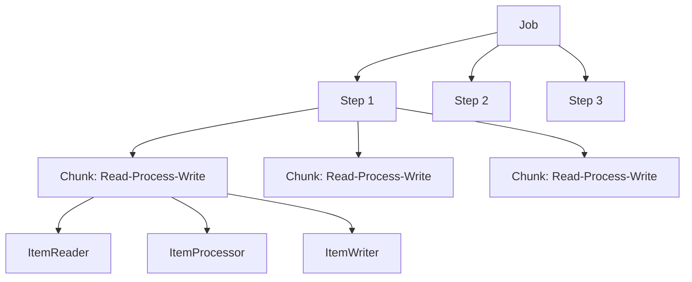

## Introdução

O Spring Batch é o framework do ecossistema Spring para processamento em lote de grandes volumes de dados. Ele oferece infraestrutura para jobs transacionais, retentativas, skip de erros e processamento chunk-based, sendo amplamente usado em tarefas como importação de arquivos, geração de relatórios e migração de dados.

## Conceitos Fundamentais



| Componente | Responsabilidade |
|------------|------------------|
| **Job** | Unidade completa de processamento em lote |
| **Step** | Fase do job (pode ter múltiplos steps) |
| **ItemReader** | Lê dados de entrada (arquivo, banco, API) |
| **ItemProcessor** | Transforma ou filtra itens |
| **ItemWriter** | Escreve dados de saída (banco, arquivo, API) |
| **Chunk** | Intervalo transacional (commit a cada N itens) |

## Configuração

```xml
<dependency>
    <groupId>org.springframework.boot</groupId>
    <artifactId>spring-boot-starter-batch</artifactId>
</dependency>
```

```yaml
spring:
  batch:
    job:
      enabled: true
    jdbc:
      initialize-schema: always
  datasource:
    url: jdbc:postgresql://localhost:5432/devault
    username: dev
    password: dev
```

## Primeiro Job: Importação de Usuários

```java
@Configuration
public class ImportacaoUsuarioJobConfig {

    private final JobRepository jobRepository;
    private final PlatformTransactionManager transactionManager;

    @Bean
    public Job importacaoUsuarioJob() {
        return new JobBuilder("importacaoUsuarioJob", jobRepository)
                .start(importarUsuariosStep())
                .next(validarDadosStep())
                .build();
    }

    @Bean
    public Step importarUsuariosStep() {
        return new StepBuilder("importarUsuariosStep", jobRepository)
                .<UsuarioCsv, Usuario>chunk(100, transactionManager)
                .reader(usuarioReader())
                .processor(usuarioProcessor())
                .writer(usuarioWriter())
                .faultTolerant()
                .skipLimit(10)
                .skip(InvalidDataException.class)
                .retryLimit(3)
                .retry(DataAccessException.class)
                .build();
    }

    @Bean
    public Step validarDadosStep() {
        return new StepBuilder("validarDadosStep", jobRepository)
                .tasklet(validacaoTasklet(), transactionManager)
                .build();
    }
}
```

## ItemReader: Lendo de Arquivo CSV

```java
@Bean
public FlatFileItemReader<UsuarioCsv> usuarioReader() {
    return new FlatFileItemReaderBuilder<UsuarioCsv>()
            .name("usuarioCsvReader")
            .resource(new FileSystemResource("data/usuarios.csv"))
            .delimited()
            .names("nome", "email", "idade")
            .linesToSkip(1)
            .targetType(UsuarioCsv.class)
            .build();
}
```

## ItemProcessor: Transformando Dados

```java
public class UsuarioProcessor implements ItemProcessor<UsuarioCsv, Usuario> {

    @Override
    public Usuario process(UsuarioCsv item) throws Exception {
        if (item.nome() == null || item.email() == null) {
            throw new InvalidDataException("Dados inválidos: " + item);
        }

        return new Usuario(
                null,
                item.nome().trim(),
                item.email().trim().toLowerCase()
        );
    }
}
```

## ItemWriter: Escrevendo no Banco

```java
@Bean
public RepositoryItemWriter<Usuario> usuarioWriter(UsuarioRepository repository) {
    return new RepositoryItemWriterBuilder<Usuario>()
            .repository(repository)
            .methodName("save")
            .build();
}
```

## Tasklet: Validação Final

```java
public class ValidacaoTasklet implements Tasklet {

    private final UsuarioRepository repository;

    @Override
    public RepeatStatus execute(StepContribution contribution, ChunkContext chunkContext) {
        var total = repository.count();
        var emailsDuplicados = repository.findEmailsDuplicados();

        if (!emailsDuplicados.isEmpty()) {
            throw new IllegalStateException(
                    "Emails duplicados encontrados: " + emailsDuplicados);
        }

        log.info("Validação concluída. Total de usuários: {}", total);
        return RepeatStatus.FINISHED;
    }
}
```

## Job Parameters

Execute o mesmo job com parâmetros diferentes:

```java
@Bean
public FlatFileItemReader<UsuarioCsv> usuarioReader(
        @Value("#{jobParameters['arquivo']}") String caminho) {
    return new FlatFileItemReaderBuilder<UsuarioCsv>()
            .name("usuarioCsvReader")
            .resource(new FileSystemResource(caminho))
            // ...
            .build();
}
```

Executando com parâmetros:

```bash
java -jar app.jar \
  arquivo=data/usuarios.csv \
  data=2026-06-24
```

## Agendando Jobs com @Scheduled

```java
@Component
public class JobScheduler {

    private final JobLauncher jobLauncher;
    private final Job importacaoUsuarioJob;

    @Scheduled(cron = "0 0 2 * * ?") // todo dia às 2h
    public void executarImportacao() {
        var params = new JobParametersBuilder()
                .addString("arquivo", "data/usuarios.csv")
                .addString("data", LocalDate.now().toString())
                .toJobParameters();

        jobLauncher.run(importacaoUsuarioJob, params);
    }
}
```

## Monitoramento de Jobs

O Spring Batch expõe métricas dos jobs executados:

```yaml
spring:
  batch:
    job:
      enabled: true
```

Tabela `BATCH_JOB_EXECUTION` no banco:

```
| JOB_EXECUTION_ID | JOB_NAME              | START_TIME          | STATUS   |
|------------------|-----------------------|---------------------|----------|
| 1                | importacaoUsuarioJob  | 2026-06-24 02:00:00 | COMPLETED |
| 2                | importacaoUsuarioJob  | 2026-06-23 02:00:00 | FAILED    |
```

## Boas Práticas

- **Chunks pequenos** — comece com 100 itens por chunk e ajuste conforme a necessidade
- **Fault tolerance** — configure skip e retry para lidar com erros transitórios
- **JobParameters únicos** — evite reexecuções acidentais incrementando um timestamp
- **Steps independentes** — divida jobs complexos em steps menores e testáveis
- **Logs detalhados** — registre progresso e erros em cada step
- **Teste com amostras** — use arquivos pequenos em testes e valide o resultado esperado

## Conclusão

O Spring Batch é a solução madura e robusta para processamento em lote no ecossistema Java. Com chunks transacionais, readers/processors/writers flexíveis e suporte a retry e skip, ele lida com grandes volumes de dados de forma confiável e com baixo consumo de memória.
