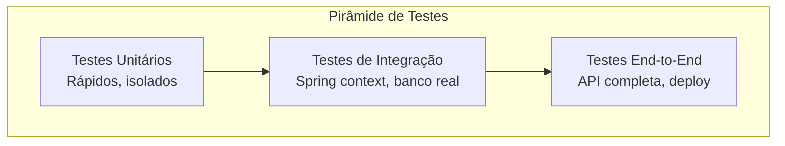

## Introdução

Testar uma aplicação Spring Boot vai muito além de rodar a aplicação e testar manualmente. Uma suíte de testes bem estruturada — combinando testes unitários, de integração e de contrato — garante que suas regras de negócio e endpoints funcionem corretamente a cada mudança.

## Tipos de Teste



## Testes Unitários com JUnit 5 e Mockito

Teste a camada de serviço isolando as dependências:

```java
@ExtendWith(MockitoExtension.class)
class UsuarioServiceTest {

    @Mock
    private UsuarioRepository repository;

    @InjectMocks
    private UsuarioService service;

    @Test
    void deveSalvarUsuarioComSucesso() {
        var usuario = new Usuario(null, "João", "joao@email.com");

        when(repository.save(any())).thenReturn(new Usuario(1L, "João", "joao@email.com"));

        var resultado = service.salvar(usuario);

        assertThat(resultado.getId()).isNotNull();
        assertThat(resultado.getNome()).isEqualTo("João");
        verify(repository).save(any());
    }

    @Test
    void deveLancarExcecaoQuandoEmailInvalido() {
        var usuario = new Usuario(null, "João", "email-invalido");

        assertThatThrownBy(() -> service.salvar(usuario))
                .isInstanceOf(IllegalArgumentException.class)
                .hasMessage("Email inválido");

        verify(repository, never()).save(any());
    }
}
```

## Testes de Integração com Spring Boot

Use `@SpringBootTest` para carregar o contexto completo:

```java
@SpringBootTest(webEnvironment = SpringBootTest.WebEnvironment.RANDOM_PORT)
class UsuarioControllerIntegrationTest {

    @Autowired
    private TestRestTemplate restTemplate;

    @Autowired
    private UsuarioRepository repository;

    @BeforeEach
    void setup() {
        repository.deleteAll();
    }

    @Test
    void deveCriarUsuarioViaAPI() {
        var request = new UsuarioRequest("Maria", "maria@email.com");

        var response = restTemplate.postForEntity("/api/usuarios", request, UsuarioResponse.class);

        assertThat(response.getStatusCode()).isEqualTo(HttpStatus.CREATED);
        assertThat(response.getBody()).isNotNull();
        assertThat(response.getBody().nome()).isEqualTo("Maria");
    }

    @Test
    void deveRetornar404QuandoUsuarioNaoExiste() {
        var response = restTemplate.getForEntity("/api/usuarios/999", String.class);

        assertThat(response.getStatusCode()).isEqualTo(HttpStatus.NOT_FOUND);
    }
}
```

## Testes de Camada Web com @WebMvcTest

Teste apenas o controller com mocking dos serviços:

```java
@WebMvcTest(UsuarioController.class)
class UsuarioControllerTest {

    @Autowired
    private MockMvc mockMvc;

    @MockitoBean
    private UsuarioService service;

    @Test
    void deveListarUsuarios() throws Exception {
        when(service.listarTodos()).thenReturn(List.of(
                new Usuario(1L, "João", "joao@email.com")
        ));

        mockMvc.perform(get("/api/usuarios"))
                .andExpect(status().isOk())
                .andExpect(jsonPath("$.size()").value(1))
                .andExpect(jsonPath("$[0].nome").value("João"));
    }
}
```

## Testes com TestContainers

Use bancos de dados reais em vez de H2 em memória:

```java
@SpringBootTest(webEnvironment = SpringBootTest.WebEnvironment.RANDOM_PORT)
@Testcontainers
class UsuarioRepositoryIntegrationTest {

    @Container
    static PostgreSQLContainer<?> postgres = new PostgreSQLContainer<>("postgres:16-alpine")
            .withDatabaseName("testdb")
            .withUsername("test")
            .withPassword("test");

    @DynamicPropertySource
    static void configureProperties(DynamicPropertyRegistry registry) {
        registry.add("spring.datasource.url", postgres::getJdbcUrl);
        registry.add("spring.datasource.username", postgres::getUsername);
        registry.add("spring.datasource.password", postgres::getPassword);
    }

    @Autowired
    private UsuarioRepository repository;

    @Test
    void devePersistirUsuario() {
        var usuario = new Usuario(null, "Teste", "teste@email.com");

        var salvo = repository.save(usuario);

        assertThat(salvo.getId()).isNotNull();
        assertThat(repository.count()).isEqualTo(1);
    }
}
```

## Organização de Testes

```
src/test/java/com/empresa/
├── unit/
│   ├── UsuarioServiceTest.java
│   └── PedidoServiceTest.java
├── integration/
│   ├── UsuarioControllerIntegrationTest.java
│   └── PedidoRepositoryIntegrationTest.java
└── contract/
    └── UsuarioApiContractTest.java
```

## Boas Práticas

- **Um assert por teste** quando possível, ou agrupe asserts relacionados
- **Nomes descritivos** — `deveLancarExcecaoQuandoEmailInvalido` em vez de `testEmail`
- **Isolamento** — cada teste deve poder rodar independentemente
- **Avoid `@SpringBootTest` global** — prefira slices como `@WebMvcTest`, `@DataJpaTest`
- **Dados limpos** — use `@BeforeEach` para garantir estado conhecido
- **Teste cenários de erro** — não apenas o caminho feliz

## Conclusão

Uma suíte de testes bem estruturada combina testes unitários rápidos com Mockito, testes de integração com contexto Spring e TestContainers, e testes de contrato para garantir que a API se comporta conforme o esperado. Invista nos testes desde o início — o retorno em confiança e produtividade é imenso.
