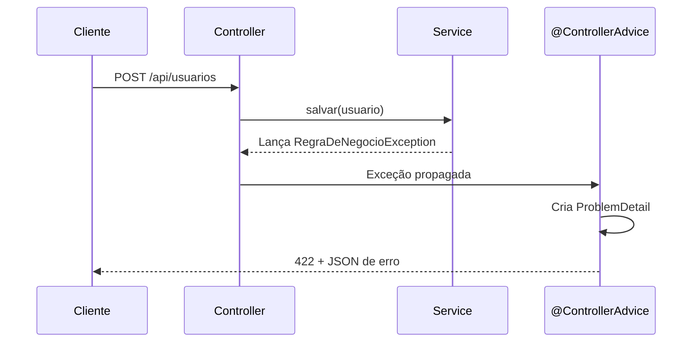

## Introdução

Um tratamento de exceções bem estruturado é essencial para APIs REST profissionais. Em vez de espalhar try-catchs pelo código, o Spring Boot oferece o `@ControllerAdvice` para centralizar a lógica de erro, garantindo respostas consistentes e informativas.

## ControllerAdvice: Centralizando o Tratamento

O `@ControllerAdvice` intercepta exceções lançadas por qualquer controller e aplica o handler correspondente:

```java
@ControllerAdvice
public class GlobalExceptionHandler {

    @ExceptionHandler(RecursoNaoEncontradoException.class)
    public ResponseEntity<ProblemDetail> handleNotFound(RecursoNaoEncontradoException ex) {
        var problem = ProblemDetail.forStatusAndDetail(HttpStatus.NOT_FOUND, ex.getMessage());
        problem.setTitle("Recurso não encontrado");
        return ResponseEntity.status(404).body(problem);
    }

    @ExceptionHandler(RegraDeNegocioException.class)
    public ResponseEntity<ProblemDetail> handleBusinessRule(RegraDeNegocioException ex) {
        var problem = ProblemDetail.forStatusAndDetail(HttpStatus.UNPROCESSABLE_ENTITY, ex.getMessage());
        problem.setTitle("Violação de regra de negócio");
        return ResponseEntity.status(422).body(problem);
    }

    @ExceptionHandler(MethodArgumentNotValidException.class)
    public ResponseEntity<ProblemDetail> handleValidation(MethodArgumentNotValidException ex) {
        var problem = ProblemDetail.forStatus(HttpStatus.BAD_REQUEST);
        problem.setTitle("Erro de validação");
        problem.setDetail("Um ou mais campos estão inválidos");

        var erros = ex.getBindingResult().getFieldErrors().stream()
                .map(f -> new ErroCampo(f.getField(), f.getDefaultMessage()))
                .toList();

        problem.setProperty("erros", erros);
        return ResponseEntity.badRequest().body(problem);
    }
}
```

## Problem Details (RFC 9457)

O Spring Boot 3+ tem suporte nativo ao RFC 9457 via `ProblemDetail`. A estrutura padronizada inclui:

```json
{
  "type": "https://devault.dev/errors/business-rule",
  "title": "Violação de regra de negócio",
  "status": 422,
  "detail": "Usuário não pode ser excluído pois possui pedidos ativos",
  "instance": "/api/usuarios/42",
  "timestamp": "2026-06-24T10:30:00Z"
}
```

Criando uma exception personalizada:

```java
public class RecursoNaoEncontradoException extends RuntimeException {
    public RecursoNaoEncontradoException(String recurso, Long id) {
        super("%s com ID %d não encontrado".formatted(recurso, id));
    }
}
```

## Erros de Validação com Campos Detalhados

Quando o Bean Validation falha (`@Valid`), é importante informar exatamente quais campos estão inválidos:

```java
public record ErroCampo(String campo, String mensagem) {}
```

Resposta:

```json
{
  "title": "Erro de validação",
  "status": 400,
  "detail": "Um ou mais campos estão inválidos",
  "erros": [
    { "campo": "email", "mensagem": "Email deve ser válido" },
    { "campo": "nome", "mensagem": "Nome é obrigatório" }
  ]
}
```

## Fluxo do Tratamento de Erros



## Validação de Argumentos de Path e Query

Valide também parâmetros de URL e path:

```java
@GetMapping("/{id}")
public ResponseEntity<Usuario> buscar(
        @PathVariable @Min(1) Long id,
        @RequestParam(required = false) @Size(max = 100) String nome) { ... }
```

```java
@ExceptionHandler(ConstraintViolationException.class)
public ResponseEntity<ProblemDetail> handleConstraintViolation(ConstraintViolationException ex) {
    var problem = ProblemDetail.forStatus(HttpStatus.BAD_REQUEST);
    problem.setTitle("Parâmetro inválido");

    var erros = ex.getConstraintViolations().stream()
            .map(v -> new ErroCampo(
                    v.getPropertyPath().toString(),
                    v.getMessage()))
            .toList();

    problem.setProperty("erros", erros);
    return ResponseEntity.badRequest().body(problem);
}
```

## Boas Práticas

- **Nunca exponha stack traces** — informações internas podem ser um risco de segurança
- **Use códigos HTTP corretos** — não retorne 200 para erros nem 500 para validações
- **Log sempre o erro** — registre o stack trace no servidor antes de responder
- **Consistência** — a estrutura de erro deve ser idêntica em toda a API
- **Mensagens em PT** — o usuário da API deve entender o erro sem contexto técnico

```java
@ExceptionHandler(Exception.class)
public ResponseEntity<ProblemDetail> handleGeneric(Exception ex) {
    log.error("Erro interno no servidor", ex);
    var problem = ProblemDetail.forStatus(HttpStatus.INTERNAL_SERVER_ERROR);
    problem.setTitle("Erro interno");
    problem.setDetail("Ocorreu um erro inesperado. Tente novamente mais tarde.");
    return ResponseEntity.status(500).body(problem);
}
```

## Conclusão

Centralizar o tratamento de exceções com `@ControllerAdvice` e padronizar as respostas com Problem Details torna sua API mais previsível, segura e fácil de consumir. Invista nessa estrutura desde o início do projeto — a manutenção agradece.
