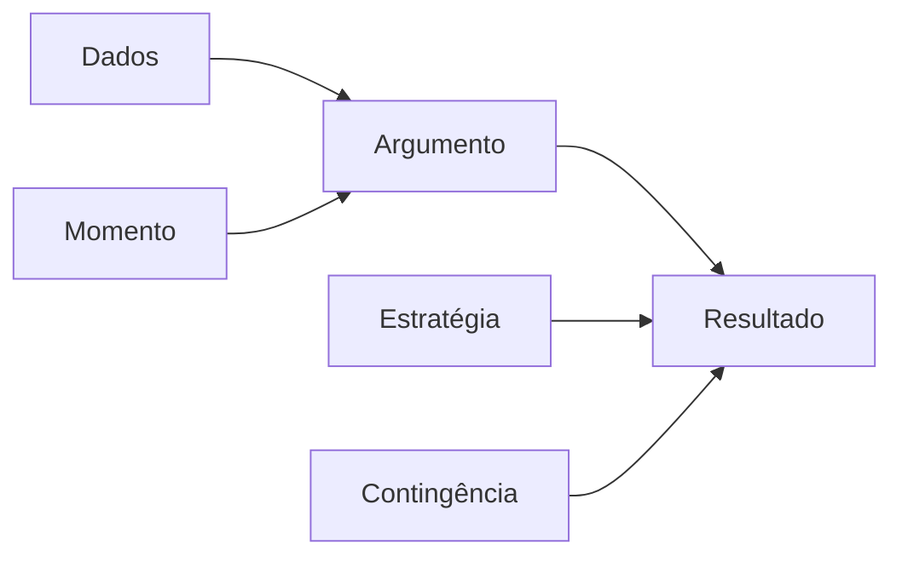
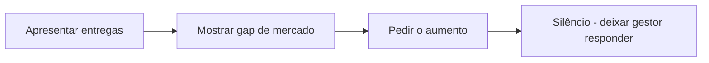

## Por Que Pedir é Desconfortável

Pedir aumento ou promoção é um dos momentos mais tensos da carreira. A maioria das pessoas espera ser reconhecida "naturalmente" — e espera, e espera. A verdade é que **ninguém vai lutar pelo seu salário tanto quanto você**.

## Os 3 Pilares do Pedido

### 1. Dados (O Mais Importante)

Seu pedido precisa ser baseado em fatos, não em necessidades pessoais ("preciso pagar o aluguel").

| O que coletar | Exemplo |
|---------------|---------|
| Entregas mensuráveis | "Reduzi custo de infra em 30%" |
| Projetos liderados | "Liderei migração de 15 microsserviços" |
| Impacto no time | "Onboardei 3 juniores em 2 meses" |
| Comparação de mercado | "Pesquisa Glassdoor: média para minha função é R$ X" |

Mantenha um **arquivo de conquistas** atualizado mensalmente. É muito mais fácil do que tentar lembrar de tudo na hora.

### 2. Momento

| Bom momento | Evitar |
|-------------|--------|
| Após entrega importante | Durante crise na empresa |
| Fim de ciclo (sprint/trimestre) | Após layoffs |
| Durante review de desempenho | Quando gestor está sobrecarregado |
| Mercado aquecido para sua stack | 1 mês antes de férias do gestor |

### 3. Estratégia de Negociação

Nunca comece com o valor. Primeiro estabeleça o valor que você entrega, depois fale de dinheiro.

## O Roteiro da Conversa

**Passo 1: Peça a reunião**

> "Gostaria de agendar 30 minutos para conversar sobre minha progressão de carreira aqui."

Não peça aumento por mensagem — marque uma call.

**Passo 2: Apresente suas entregas**

> "Neste último ano, entreguei X, Y e Z. Especificamente, liderei a migração que reduziu custos em 30%, implementei CI/CD que cortou falhas em deploy pela metade, e mentorei 2 desenvolvedores juniores que agora são plenos."

**Passo 3: Contextualize com o mercado**

> "Pesquisei faixas salariais para minha função e senioridade. A média para desenvolvedor pleno na nossa região está entre R$ X e R$ Y. Estou há 2 anos na empresa sem reajuste."

**Passo 4: Peça claramente**

> "Baseado nisso, gostaria de solicitar uma promoção para desenvolvedor sênior com o respectivo ajuste salarial."

**Passo 5: Silêncio**

Depois de pedir, fique em silêncio. Deixe o gestor processar e responder.

## Se a Resposta For "Não"

| Resposta do gestor | Sua contra-argumentação |
|--------------------|------------------------|
| "Não tem verba" | "Entendo. Quais entregas seriam necessárias para justificar no próximo ciclo?" |
| "Você está no teto do cargo" | "Podemos discutir uma promoção de nível?" |
| "Precisa esperar mais" | "O que exatamente precisa mudar para eu ser elegível? Podemos definir um plano com prazo?" |

Sempre saia com **próximos passos concretos**:

- Plano de desenvolvimento com critérios claros
- Próxima data de revisão (máximo 3 meses)
- Métricas para avaliar progresso

## E Se Mesmo Assim Não Rolar?

- **Atualize o LinkedIn** e ative #OpenToWork
- **Faça entrevistas** em outras empresas (mesmo sem intenção de sair — saber seu valor de mercado é poder)
- **Peça outros benefícios** se ajuste não for possível: horário flexível, budget de cursos, dias remotos adicionais
- **Considere a troca** — mudar de empresa costuma render aumentos de 30-50%

## Conclusão

Pedir aumento é um processo racional, não emocional. Prepare dados, escolha o momento, apresente com confiança. E lembre-se: você está pedindo o que já vale, não um favor.
