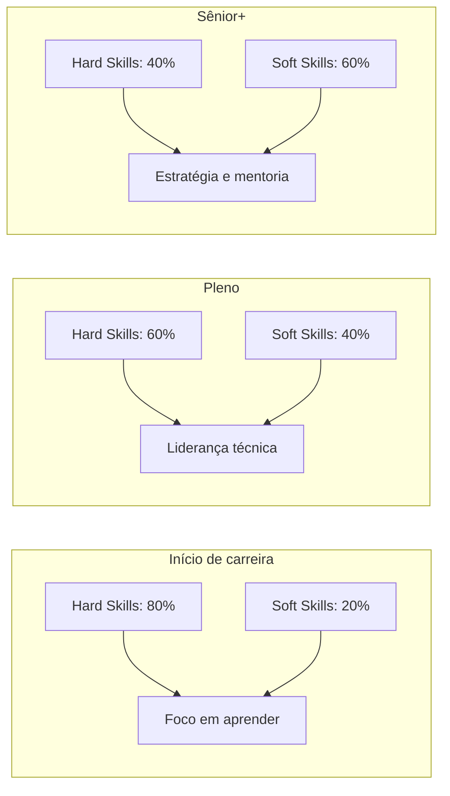
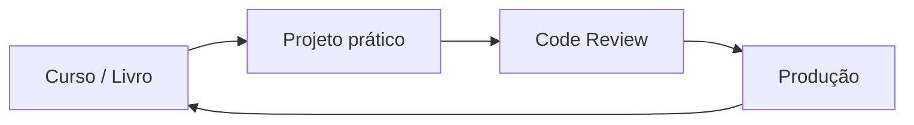

## O Debate

Todo profissional de tecnologia já ouviu alguma variação de:

> "Soft skills são mais importantes que hard skills"
> "Se você é bom tecnicamente, o resto não importa"

Ambas as frases são exageradas. A verdade é que **hard skills te levam para a entrevista, soft skills te fazem ficar**.

## O Que São Hard Skills

Habilidades técnicas, mensuráveis e específicas:

- **Linguagens:** Java, Python, TypeScript, Go, Rust
- **Frameworks:** Spring Boot, React, Next.js, Django
- **Ferramentas:** Docker, Kubernetes, Terraform, Jenkins
- **Conceitos:** Algoritmos, estruturas de dados, arquitetura de software
- **Certificações:** AWS Solutions Architect, CKAD, Oracle Java

São o requisito mínimo. Sem elas, você não passa da triagem técnica.

## O Que São Soft Skills

Habilidades comportamentais e interpessoais:

| Soft Skill | Por que importa |
|------------|----------------|
| **Comunicação** | Explicar decisões técnicas para não-técnicos |
| **Trabalho em equipe** | Código é escrito em time, não sozinho |
| **Resolução de problemas** | Tecnologia existe para resolver problemas de negócio |
| **Adaptabilidade** | Stack muda a cada 2-3 anos |
| **Empatia** | Entender dor do usuário e do colega |
| **Gestão de tempo** | Entregar no prazo sem sacrificar qualidade |

## A Matriz de Carreira

### Início de Carreira (80/20)

Foco total em aprender a programar bem. Entregue código limpo, entenda os fundamentos. Soft skills básicas (comunicação e trabalho em equipe) são suficientes nessa fase.

### Nível Pleno (60/40)

Você já entrega código com autonomia. Agora precisa:
- Revisar código dos outros com respeito
- Participar de discussões de arquitetura
- Estimular prazos realistas
- Comunicar blockers proativamente

### Sênior e Acima (40/60)

Seu valor não está mais só no código, mas em:
- Mentoria de juniores
- Definição de estratégia técnica
- Alinhamento entre times
- Tomada de decisão com dados
- Influência sem autoridade

## Como Desenvolver Cada Uma

### Hard Skills

1. Escolha uma tecnologia por vez
2. Faça um projeto real com ela
3. Peça code review para alguém mais experiente
4. Coloque em produção (Vercel, Railway, AWS)
5. Repita

### Soft Skills

| Como desenvolver | Onde praticar |
|-----------------|---------------|
| Escrever documentação clara | READMEs, ADRs, wiki do time |
| Apresentar resultados | Review mensal, demo para stakeholders |
| Dar feedback | Code reviews, 1:1 com gestor |
| Negociar prazos | Planning, refinamento |
| Ensinar | Pair programming, onboarding |

## Conclusão

Não existe competição entre hard e soft skills — elas se complementam. Profissionais completos são raros justamente porque é difícil dominar ambos. Comece com o que falta mais em você hoje e crie um plano intencional de desenvolvimento.
