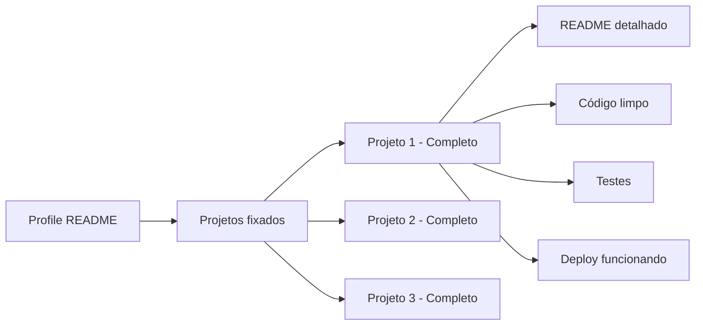

## A Diferença Fundamental

- **Currículo:** O que você diz que sabe fazer
- **Portfólio:** O que você prova que sabe fazer

Num mercado competitivo, o portfólio é o que separa quem é contratado de quem fica esperando.

## Currículo: A Porta de Entrada

### Regras de Ouro

| Regra | Por quê |
|-------|---------|
| **1 página** | Recrutador gasta 6 segundos na primeira leitura |
| **PDF sempre** | Word quebra formatação, Canva não é parseável por ATS |
| **Sem foto** | No Brasil não é obrigatório e pode gerar viés |
| **Sem "objetivo"** | Ninguém quer saber que você quer "crescer profissionalmente" |
| **Resultados > Responsabilidades** | "Reduzi custo em 30%" > "Era responsável pela infra" |

### Estrutura de Currículo

```
[NOME]
[Tech Stack Principal] · [Localização] · [LinkedIn] · [GitHub]

EXPERIÊNCIA
Empresa X | Desenvolvedor Backend | Jan 2022 - Presente
- Migrei monólito para microsserviços, reduzindo downtime em 95%
- Implementei pipeline CI/CD com deploy automático
- Liderei time de 4 devs na entrega do módulo de pagamentos

Empresa Y | Desenvolvedor Junior | Mar 2020 - Dez 2021
- Desenvolvi APIs REST com Spring Boot e PostgreSQL
- Participei da migração para cloud (AWS)

EDUCAÇÃO
Bacharel em Ciência da Computação | Universidade X | 2016 - 2020

TECNOLOGIAS
Java, Spring Boot, Kafka, PostgreSQL, AWS, Docker, Kubernetes
```

## Portfólio: A Prova Social

Seu portfólio não precisa ser um site bonito. Pode ser seu GitHub bem organizado.

### Organização do GitHub



### Profile README (obrigatório)

Crie um repositório com seu nome (`github.com/seunome`) e adicione um README:

```markdown
## Olá! 👋

Sou desenvolvedor backend com foco em Java e Spring Boot.

🔭 Atualmente trabalhando em: [projeto]
🌱 Aprendendo: Kafka e Kubernetes
👯 Busco colaborar em: projetos open source
📫 Como me achar: [LinkedIn] · [email]
```

### O Que Torna um Projeto Atraente

| Elemento | Impacto |
|----------|---------|
| README com captura de tela | Alto |
| Link para deploy funcionando | Altíssimo |
| Testes automatizados | Alto |
| CI/CD configurado | Médio |
| Commits descritivos | Médio |
| Issues e Projects | Baixo |

## Exemplo de README de Portfólio

```markdown
# API de Controle Financeiro

API REST para controle de finanças pessoais com categorização automática de transações.

## Stack

- Java 17 + Spring Boot 3
- PostgreSQL + MongoDB (híbrido)
- Docker + Docker Compose
- GitHub Actions (CI/CD)
- Deployed no Railway

## Funcionalidades

- [x] CRUD de transações
- [x] Categorização automática por descrição
- [x] Dashboard com gastos por mês
- [x] Export CSV
- [x] Autenticação JWT

## Como rodar

```bash
git clone https://github.com/seunome/financeiro-api
cd financeiro-api
docker compose up
```

API disponível em `http://localhost:8080`

## Testes

```bash
./mvnw test
```

Cobertura: 85% (unitários + integração)
```

## Quando Usar Cada Um

| Situação | Currículo | Portfólio |
|----------|-----------|-----------|
| Candidatura em processo seletivo | ✅ Essencial | ❌ Opcional |
| LinkedIn | ✅ Essencial | ✅ Link no perfil |
| Entrevista técnica | ✅ Leve impresso | ✅ Mostre projetos |
| Networking / eventos | ✅ Leve impresso | ✅ Tenha o GitHub pronto |
| Primeira vaga | ✅ Essencial | ✅ Essencial |
| Sênior+ | ✅ Essencial | ✅ Contribuições open source |

## Conclusão

Currículo abre a porta, portfólio te faz entrar. Invista tempo em ambos, mas priorize o portfólio — um projeto bem feito com deploy funcionando vale mais que 10 páginas de currículo cheias de buzzwords.
