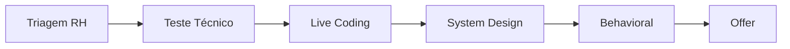
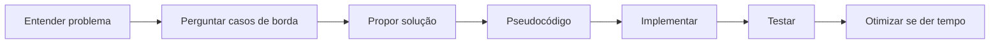

## O Processo Típico



## Triagem com RH (30 min)

Não é uma conversa informal — é uma entrevista de verdade.

**O que avaliam:**
- Sua comunicação e clareza
- Fit cultural (valores, trabalho em equipe)
- Alinhamento de expectativas (salário, modelo de trabalho)
- Se você realmente sabe o que está no seu currículo

**Perguntas comuns:**
- "Me conte sobre você"
- "Por que quer sair da empresa atual?"
- "O que busca na próxima oportunidade?"
- "Onde você se vê em 2 anos?"

**Prepare:**
- Um pitch de 2 minutos sobre sua trajetória
- Motivos positivos para sair (crescimento, desafio, não "ambiente tóxico")
- 3 perguntas para fazer sobre a vaga e a empresa

## Teste Técnico (2-7 dias)

**O que avaliam:**
- Organização do código
- Decisões arquiteturais
- Cobertura de testes
- Documentação (README)

Boas práticas para o teste:

```java
// Código limpo: nomes descritivos, sem comentários óbvios
public class OrderService {

    private final OrderRepository repository;
    private final PaymentGateway paymentGateway;
    private final NotificationService notificationService;

    public OrderResult processOrder(OrderRequest request) {
        validateItems(request.items());

        PaymentResult payment = paymentGateway.charge(
            request.total(), request.paymentMethod());

        Order order = new Order(request, payment.transactionId());
        repository.save(order);

        notificationService.send(order.customerEmail(),
            "Pedido #" + order.id() + " confirmado!");

        return new OrderResult(order.id(), payment.status());
    }
}
```

**Checklist antes de entregar:**
- [ ] README com instruções claras (como rodar, testes, decisões)
- [ ] Testes unitários para lógica principal
- [ ] Tratamento de erros (não deixe exceptions sem tratamento)
- [ ] Commits bem escritos (não um commit gigante)
- [ ] Docker compose se tiver dependências externas

## Live Coding (45-90 min)

O momento mais temido. A chave não é resolver tudo — é **pensar em voz alta**.



**O que fazer:**
- Pergunte **antes** de codificar: "Quais são os casos de borda? O que fazer se X for nulo?"
- Escreva código simples primeiro, otimize depois
- Se travar, fale: "Estou pensando em duas abordagens: X e Y. Qual prefere que eu siga?"
- Teste manualmente após implementar: "Se a entrada for [1, 2, 3], a saída esperada seria..."

**Problemas comuns:**

| Categoria | Exemplo | Estratégia |
|-----------|---------|------------|
| Arrays/Strings | Two Sum, Valid Parentheses | Ponteiros, hash map |
| Árvores/Grafos | Lowest Common Ancestor | DFS, BFS |
| Programação dinâmica | Knapsack, Fibonacci | Tabela bottom-up |
| Design de OO | Estacionamento, Vending Machine | Classes, interfaces, padrões |

## System Design (60 min)

Para vagas pleno/sênior. Avalia sua visão arquitetural.

**Tópicos clássicos:**
- Design do Twitter/Instagram
- Encurtador de URL (tinyURL)
- Chat em tempo real
- Rate limiter
- Sistema de arquivos distribuído

**Estrutura da resposta:**

| Fase | Duração | O que fazer |
|------|---------|-------------|
| Entender requisitos | 10min | Funcionais + não funcionais (latência, disponibilidade) |
| Estimar capacidade | 5min | QPS, armazenamento, banda |
| Desenhar high-level | 15min | Componentes principais (API, serviço, banco) |
| Aprofundar | 20min | Banco, cache, filas, particionamento |
| Pontos extras | 10min | Monitoramento, deploy, evolução |

## Behavioral (30-45 min)

**Método STAR:**

| Letra | Significado | Exemplo |
|-------|-------------|---------|
| **S**ituation | Contexto | "No meu time anterior, tínhamos um problema com deploys demorados..." |
| **T**ask | Seu papel | "Fui designado para liderar a melhoria do pipeline..." |
| **A**ction | O que fez | "Implementei CI/CD com GitHub Actions, parallelizei etapas e adicionei testes automáticos." |
| **R**esult | Resultado | "Reduzimos o tempo de deploy de 2h para 15min, com 99% de taxa de sucesso." |

**Perguntas frequentes:**
- "Conte sobre um conflito que resolveu"
- "Um projeto que deu errado"
- "Uma decisão técnica que se arrepende"
- "Como lida com prazos apertados?"

Prepare 5 histórias STAR que cubram: liderança, erro, conflito, decisão técnica, inovação.

## Conclusão

Entrevista técnica é uma habilidade que se treina, não um dom. Simule o ambiente real: faça live coding cronometrado, grave sua resposta para perguntas STAR, desenhe system design no papel. Cada processo te deixa melhor para o próximo.
