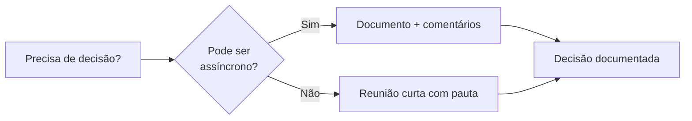
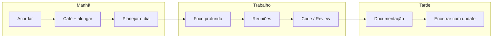

## O Novo Normal

O trabalho remoto veio para ficar. Empresas como GitLab, Shopify e Dropbox são remote-first. No Brasil, Nubank, iFood, AWS e dezenas de outras adotaram modelos híbridos ou totalmente remotos. Mas trabalhar de casa não é fácil — e não é para todos.

## Prós

| Vantagem | Impacto |
|----------|---------|
| **Fim do deslocamento** | 2+ horas por dia recuperadas |
| **Flexibilidade de horário** | Trabalhe no seu pico de produtividade |
| **Mais tempo com família** | Presente em momentos importantes |
| **Economia financeira** | Transporte, alimentação, roupas |
| **Trabalhar de qualquer lugar** | Mudança de cidade, viagens, coworking |

## Contras

| Desvantagem | Por que acontece |
|-------------|------------------|
| **Solidão** | Ausência de interação social do escritório |
| **Dificuldade de desconectar** | Escritório fica no quarto/sala |
| **Comunicação assíncrona lenta** | Decisões simples viram threads de 2 dias |
| **Falta de visibilidade** | "Fora da vista, fora da mente" |
| **Sobreposição de horários** | Time global = reuniões em horários estranhos |

## Como se Destacar no Remoto

### 1. Comunicação Escrita Exemplar

No remoto, **escrever bem é sua principal habilidade**. Ninguém vai na sua mesa perguntar.

**Boas práticas:**

```markdown
## Proposta: Migrar CI/CD para GitHub Actions

**Contexto:** Atualmente usamos Jenkins on-premise. Manutenção toma 8h/semana.

**Proposta:** Migrar para GitHub Actions com auto-scaling.

**Benefícios:**
- Zero manutenção de infraestrutura
- Integração nativa com GitHub
- Custo estimado: R$ 200/mês (vs R$ 800 do servidor Jenkins)

**Riscos:**
- Curva de aprendizado inicial (1 semana)
- Dependência de terceiros

**Próximos passos:**
1. Criar POC com 1 pipeline (2 dias)
2. Validar com time (1 reunião)
3. Migrar gradualmente (2 semanas)

O que acham?
```

### 2. Documentação > Reunião

Antes de marcar uma reunião, pergunte: **"Isso poderia ser um documento?"**



| Situação | Reunião | Documento |
|----------|---------|-----------|
| Alinhamento semanal | ✅ 30 min | ❌ |
| Decisão arquitetural | ❌ | ✅ ADR |
| Code review | ❌ | ✅ Pull Request |
| Sprint planning | ✅ 1h | ❌ |
| Definição de requisitos | ❌ | ✅ Documento de especificação |

### 3. Visibilidade Proativa

| Ação | Frequência | Impacto |
|------|------------|---------|
| Daily update no Slack | Diário | Médio |
| Documentar entregas na wiki | Semanal | Alto |
| Compartilhar aprendizado | Quinzenal | Alto |
| Apresentar em demo/review | Mensal | Altíssimo |
| 1:1 com gestor | Semanal | Alto |

### 4. Rotina e Ambiente

**Monte seu espaço:**

- Cadeira ergonômica (invista, sua coluna agradece)
- Monitor externo (mínimo 24")
- Headset com cancelamento de ruído
- Iluminação boa para reuniões de vídeo
- Internet com backup (4G/5G)

**Crie rituais:**



## Ferramentas Recomendadas

| Categoria | Ferramenta |
|-----------|------------|
| Comunicação síncrona | Slack, Discord |
| Vídeo chamada | Google Meet, Zoom |
| Documentação | Notion, Obsidian, GitBook |
| Quadros | Miro, Figma (diagramas), Excalidraw |
| Gestão de tarefas | Linear, Jira, GitHub Projects |
| Pomodoro / foco | Forest, Pomodoro Timer |
| Música para foco | Lofi, MyNoise, Brain.fm |

## Conclusão

Trabalho remoto é uma habilidade que se desenvolve, não um benefício que se ganha. Comunicação escrita clara, documentação proativa e uma rotina estruturada são o que separa quem prospera de quem apenas sobrevive no home office.
