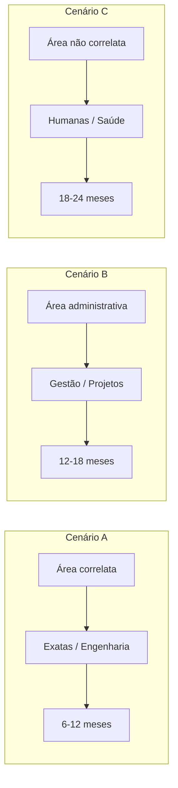
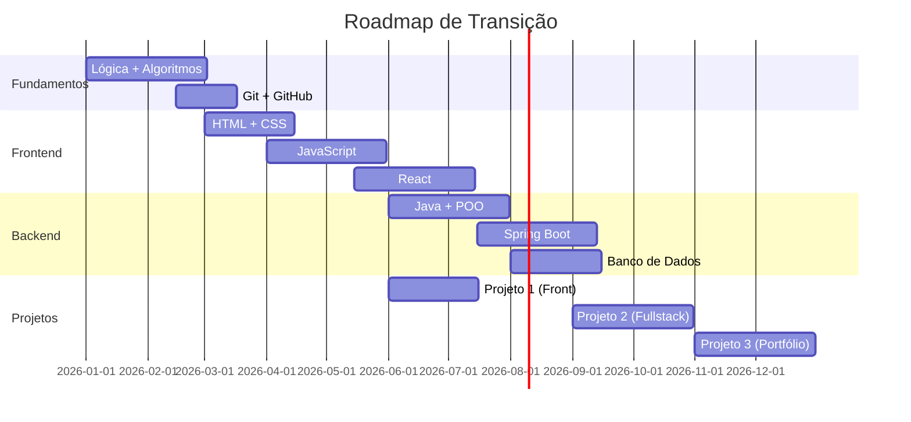

## É Possível?

Sim. A maioria das pessoas em tecnologia não se formou em Ciência da Computação. Advogados, engenheiros, administradores, músicos — todos podem fazer a transição. O que difere é o método e a disciplina.

## Os 3 Cenários de Transição

### Cenário A: Área Correlata (6-12 meses)

Engenheiros, físicos, matemáticos e outros profissionais de exatas têm vantagem. O raciocínio lógico e a base matemática já estão desenvolvidos.

**Foco:**
- Lógica de programação + algoritmo
- Uma linguagem (Python ou Java)
- Projetos práticos intensivos

### Cenário B: Área Administrativa (12-18 meses)

Profissionais de gestão, projetos e processos têm transferível a soft skill de organização e comunicação.

**Foco:**
- Fundamentos de computação (como computador funciona, rede, banco)
- Lógica de programação
- Uma stack completa (React + Node ou Java + Spring)
- Projeto integrador com front, back e banco

### Cenário C: Área Não Correlata (18-24 meses)

Direito, saúde, letras, artes — a transição é mais longa, mas igualmente possível.

**Foco:**
- Os mesmos passos do Cenário B, com mais tempo para fundamentos
- Comunidade e mentoria são essenciais aqui
- Aceitar estágio como porta de entrada

## Roteiro de Estudos (12 Meses)

## Como se Posicionar Durante a Transição

### LinkedIn

Sua headline deve mostrar direcionamento, não o que você é agora:

> ❌ "Advogado em transição para TI"
> ✅ "Desenvolvedor em formação | Java | Spring Boot | Construindo projetos fullstack"

Isso mostra para recrutadores que você já está na área, não apenas "querendo entrar".

### Portfólio de Transição

Durante o primeiro ano, construa 3 projetos:

| Projeto | Escopo | Quando |
|---------|--------|--------|
| **Landing page pessoal** | HTML + CSS + JS puro | Mês 3 |
| **Aplicativo de tarefas** | React + localStorage | Mês 6 |
| **Sistema completo** | CRUD com auth + banco + deploy | Mês 9-12 |

O terceiro projeto é o que vai te dar a primeira vaga. Invista nele.

## Onde Conseguir a Primeira Oportunidade

| Caminho | Tempo médio | Dificuldade |
|---------|-------------|-------------|
| **Estágio** | 6-12 meses de estudo | Baixa |
| **Programa de formação** (Accenture, DIO, Ada) | 3-6 meses | Média |
| **Freela / Projeto real** | Networking ativo | Alta |
| **Indicação** | Quando tiver portfólio pronto | Média |
| **Primeiro emprego CLT** | 12-18 meses de estudo | Alta |

## Obstáculos Comuns

| Obstáculo | Como superar |
|-----------|-------------|
| **Síndrome do impostor** | Todo mundo passa. Foque no progresso, não na comparação |
| **Paralisia por excesso de conteúdo** | Escolha uma stack e ignore o resto |
| **Falta de tempo** | 1 hora por dia > 8 horas no fim de semana |
| **Rejeição nas entrevistas** | Cada "não" refina seu preparo para o próximo "sim" |
| **Comparação com quem já está na área** | Você está correndo sua própria corrida |

## Conclusão

Transição de carreira não é um sprint, é uma maratona. Os primeiros 6 meses são os mais difíceis — você não entende nada e tudo parece impossível. Depois do primeiro ano, o ritmo acelera. Depois do primeiro emprego, a transição está completa. Persista.
