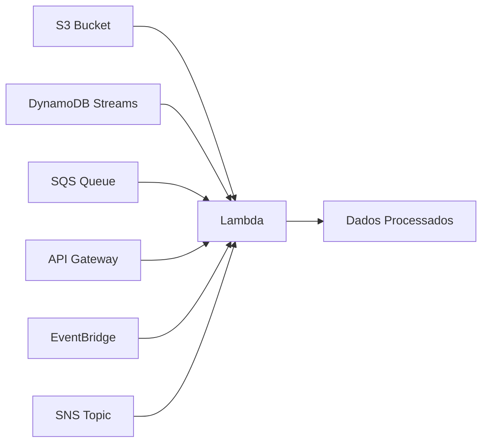

## O que é o AWS Lambda?

AWS Lambda é um serviço de computação serverless que executa código sob demanda sem provisionamento de servidores. Você paga apenas pelo tempo de execução e pelas requisições.

## Criando sua Primeira Função

```java
package com.dev.vault;

import com.amazonaws.services.lambda.runtime.Context;
import com.amazonaws.services.lambda.runtime.RequestHandler;
import com.amazonaws.services.lambda.runtime.events.APIGatewayProxyRequestEvent;
import com.amazonaws.services.lambda.runtime.events.APIGatewayProxyResponseEvent;

import java.util.Map;

public class HelloHandler implements
    RequestHandler<APIGatewayProxyRequestEvent, APIGatewayProxyResponseEvent> {

    @Override
    public APIGatewayProxyResponseEvent handleRequest(
            APIGatewayProxyRequestEvent request, Context context) {

        String name = request.getQueryStringParameters() != null
            ? request.getQueryStringParameters().getOrDefault("name", "Mundo")
            : "Mundo";

        return new APIGatewayProxyResponseEvent()
            .withStatusCode(200)
            .withHeaders(Map.of("Content-Type", "application/json"))
            .withBody(String.format("{\"message\": \"Olá, %s!\", \"status\": \"ok\"}", name));
    }
}
```

## Triggers e Event Sources



| Fonte | Evento | Caso de Uso |
|-------|--------|-------------|
| API Gateway | Requisição HTTP | REST APIs serverless |
| S3 | Upload/delete de objeto | Processamento de imagens |
| SQS | Mensagem na fila | Processamento assíncrono |
| DynamoDB Streams | Alteração em tabela | Replicação de dados |
| EventBridge | Evento agendado | Tarefas cron |
| SNS | Notificação publicada | Fan-out de eventos |

## Processamento de Upload no S3

```java
package com.dev.vault;

import com.amazonaws.services.lambda.runtime.Context;
import com.amazonaws.services.lambda.runtime.RequestHandler;
import com.amazonaws.services.lambda.runtime.events.S3Event;
import software.amazon.awssdk.services.s3.S3Client;
import software.amazon.awssdk.services.s3.model.GetObjectRequest;

import javax.imageio.ImageIO;
import java.awt.image.BufferedImage;
import java.io.ByteArrayOutputStream;
import java.io.InputStream;

public class ImageResizer implements RequestHandler<S3Event, Void> {

    private final S3Client s3 = S3Client.create();

    @Override
    public Void handleRequest(S3Event event, Context context) {
        for (var record : event.getRecords()) {
            String bucket = record.getS3().getBucket().getName();
            String key = record.getS3().getObject().getKey();

            if (!key.startsWith("uploads/")) continue;

            // Baixar imagem
            InputStream imageStream = s3.getObject(
                GetObjectRequest.builder()
                    .bucket(bucket).key(key)
                    .build());

            // Redimensionar para thumbnail (150x150)
            BufferedImage original = ImageIO.read(imageStream);
            BufferedImage thumbnail = new BufferedImage(150, 150, BufferedImage.TYPE_INT_RGB);
            thumbnail.getGraphics().drawImage(
                original.getScaledInstance(150, 150, java.awt.Image.SCALE_SMOOTH),
                0, 0, null);

            // Salvar no S3
            ByteArrayOutputStream baos = new ByteArrayOutputStream();
            ImageIO.write(thumbnail, "jpg", baos);
            s3.putObject(req -> req
                .bucket(bucket)
                .key(key.replace("uploads/", "thumbnails/")),
                software.amazon.awssdk.core.sync.RequestBody.fromBytes(baos.toByteArray()));
        }
        return null;
    }
}
```

## Lambda com DynamoDB

```java
package com.dev.vault;

import software.amazon.awssdk.services.dynamodb.DynamoDbClient;
import software.amazon.awssdk.services.dynamodb.model.AttributeValue;
import com.amazonaws.services.lambda.runtime.events.DynamodbEvent;
import com.amazonaws.services.lambda.runtime.Context;
import com.amazonaws.services.lambda.runtime.RequestHandler;

import java.util.Map;

public class OrderProcessor implements RequestHandler<DynamodbEvent, Void> {

    private final DynamoDbClient dynamoDb = DynamoDbClient.create();

    @Override
    public Void handleRequest(DynamodbEvent event, Context context) {
        for (var record : event.getRecords()) {
            if (record.getEventName().equals("INSERT")) {
                Map<String, AttributeValue> item = record.getDynamodb().getNewImage();

                String orderId = item.get("orderId").s();
                String customer = item.get("customer").s();
                double total = Double.parseDouble(item.get("total").n());

                // Processar pedido
                System.out.println("Pedido recebido: " + orderId +
                    " | Cliente: " + customer + " | Total: R$" + total);

                // Atualizar status
                dynamoDb.updateItem(req -> req
                    .tableName("Orders")
                    .key(Map.of("orderId", AttributeValue.fromS(orderId)))
                    .updateExpression("SET #status = :status")
                    .expressionAttributeNames(Map.of("#status", "status"))
                    .expressionAttributeValues(
                        Map.of(":status", AttributeValue.fromS("PROCESSADO"))));
            }
        }
        return null;
    }
}
```

## Limites e Boas Práticas

| Recurso | Limite |
|---------|--------|
| Memória | 128 MB a 10.240 MB |
| Timeout | 15 minutos (900s) |
| Payload (request/response) | 6 MB (sync), 256 KB (async) |
| /tmp storage | 512 MB a 10.240 MB |
| Concorrência | 1.000 (padrão, ajustável) |

### Práticas Recomendadas

- **Cold start:** Minimize dependências, use SnapStart (Java)
- **Concorrência reservada:** Garanta capacidade para funções críticas
- **DLQ:** Configure Dead Letter Queue para falhas de processamento
- **Ambientes separados:** Use aliases (`dev`, `prod`) com versões
- **Powertools:** Use AWS Lambda Powertools para logging estruturado e tracing

## Conclusão

Lambda permite construir aplicações totalmente serverless sem se preocupar com servidores. Combinado com S3, DynamoDB, SQS e API Gateway, você cria sistemas escaláveis com zero gerenciamento de infraestrutura.
