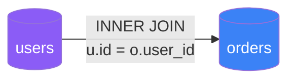
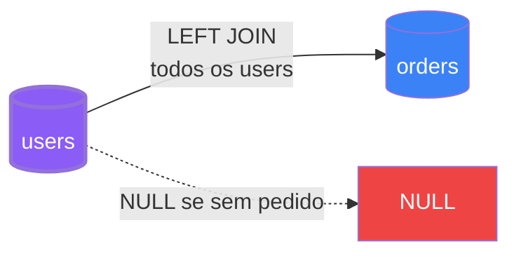
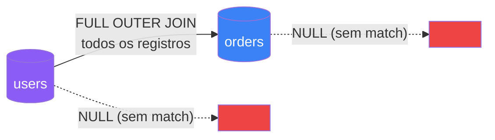

## Introdução

JOINs são cláusulas SQL usadas para combinar registros de duas ou mais tabelas baseadas em uma coluna relacionada entre elas.

## INNER JOIN

Retorna apenas os registros com correspondência em ambas as tabelas:



```sql
SELECT u.name, o.order_date, o.total
FROM users u
INNER JOIN orders o ON u.id = o.user_id;
```

| name | order_date | total |
|------|------------|-------|
| João | 2026-01-15 | 250.00 |
| Maria | 2026-01-16 | 180.00 |

## LEFT JOIN

Retorna todos os registros da tabela esquerda e os correspondentes da direita:



```sql
SELECT u.name, o.order_date, o.total
FROM users u
LEFT JOIN orders o ON u.id = o.user_id;
```

## RIGHT JOIN

Retorna todos os registros da tabela direita e os correspondentes da esquerda:


```sql
SELECT u.name, o.order_date, o.total
FROM users u
RIGHT JOIN orders o ON u.id = o.user_id;
```

## FULL OUTER JOIN

Retorna todos os registros quando há correspondência em qualquer uma das tabelas:



```sql
SELECT u.name, o.order_date
FROM users u
FULL OUTER JOIN orders o ON u.id = o.user_id;
```

## Dicas de Performance

| Tipo | Performance | Uso Recomendado |
|------|-------------|-----------------|
| INNER | Ótima | Consultas mais comuns |
| LEFT | Boa | Quando precisa de todos os registros da esquerda |
| RIGHT | Boa | Quando precisa de todos os registros da direita |
| FULL | Mais lenta | Casos específicos de auditoria |

## Conclusão

Entender JOINs é fundamental para qualquer pessoa que trabalhe com bancos de dados relacionais. Pratique com diferentes cenários para dominar o conceito.
