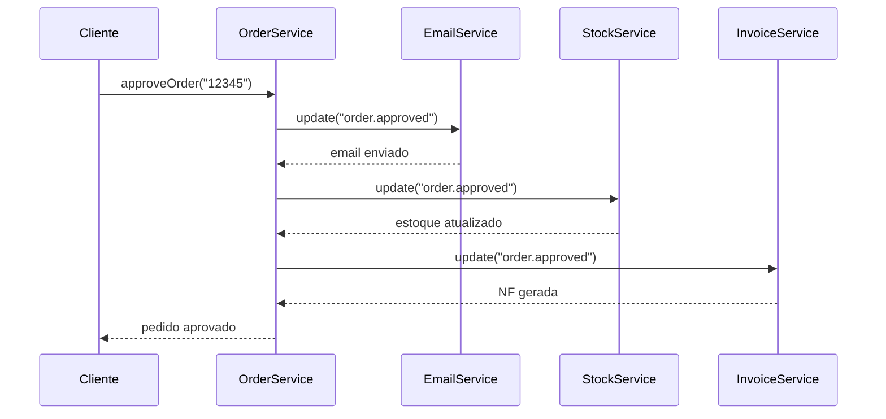

## Observer Pattern

O padrão Observer define uma dependência um-para-muitos entre objetos, de modo que quando um objeto muda de estado, todos os seus dependentes são notificados automaticamente.

## Problema

Em um sistema de e-commerce, quando um pedido é aprovado, vários componentes precisam reagir: enviar email, atualizar estoque, gerar nota fiscal, notificar o cliente. Acoplar todos esses componentes diretamente torna o sistema frágil.

## Solução

O sujeito (subject) mantém uma lista de observadores e os notifica quando seu estado muda. Os observadores decidem como reagir.

## Fluxo do Pattern



## Exemplo em TypeScript

```typescript
// Observer interface
interface Observer {
  update(event: string, data: unknown): void;
}

// Subject
class OrderService {
  private observers: Observer[] = [];

  addObserver(observer: Observer) {
    this.observers.push(observer);
  }

  removeObserver(observer: Observer) {
    this.observers = this.observers.filter(o => o !== observer);
  }

  private notify(event: string, data: unknown) {
    for (const observer of this.observers) {
      observer.update(event, data);
    }
  }

  approveOrder(orderId: string) {
    // Lógica de aprovação...
    this.notify("order.approved", { orderId });
  }
}

// Concrete observers
class EmailService implements Observer {
  update(event: string, data: any) {
    if (event === "order.approved") {
      console.log(`Enviando email para o pedido ${data.orderId}`);
    }
  }
}

class StockService implements Observer {
  update(event: string, data: any) {
    if (event === "order.approved") {
      console.log(`Atualizando estoque para o pedido ${data.orderId}`);
    }
  }
}

class InvoiceService implements Observer {
  update(event: string, data: any) {
    if (event === "order.approved") {
      console.log(`Gerando NF para o pedido ${data.orderId}`);
    }
  }
}

// Usage
const orderService = new OrderService();
orderService.addObserver(new EmailService());
orderService.addObserver(new StockService());
orderService.addObserver(new InvoiceService());

orderService.approveOrder("12345");
```

## Benefícios

- **Baixo acoplamento**: sujeito e observadores são independentes
- **Broadcast**: um evento pode disparar múltiplas ações
- **Extensibilidade**: novos observadores podem ser adicionados sem modificar o sujeito

## Casos de Uso Reais

- EventEmitter do Node.js
- RxJS (Observables)
- Sistemas de eventos em interfaces gráficas
- Webhooks e message brokers

## Conclusão

O Observer é fundamental para arquiteturas orientadas a eventos e sistemas reativos. Ele permite que componentes evoluam de forma independente enquanto reagem a mudanças no sistema.
