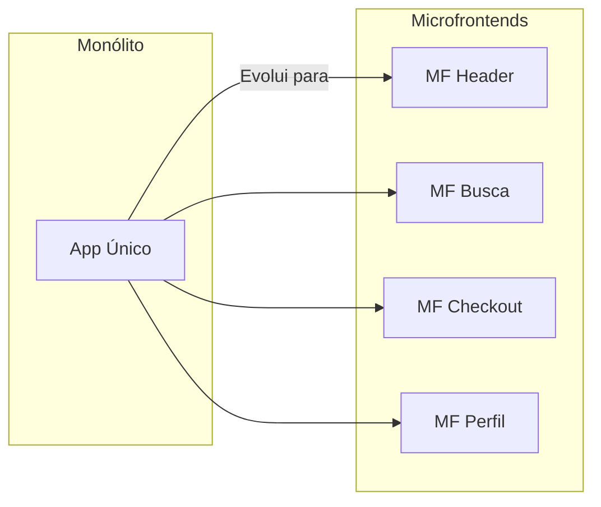
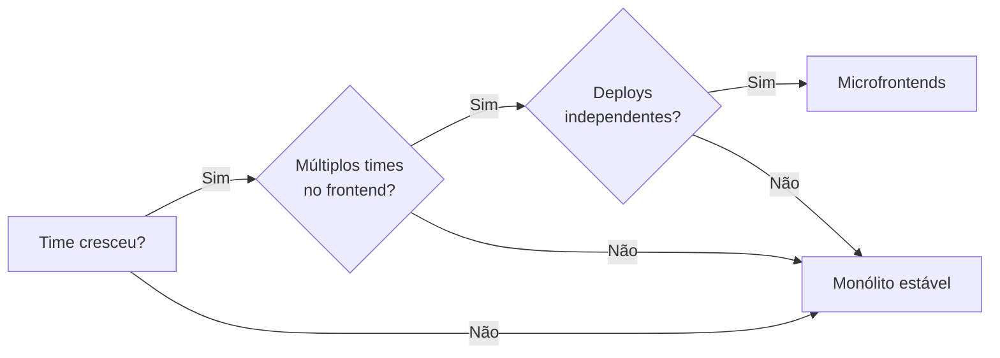

## O Que São Microfrontends?

Microfrontends estendem o conceito de microsserviços para o frontend: dividir uma aplicação monolítica em partes menores, independentes e gerenciadas por times diferentes.



## Abordagens de Integração

| Abordagem | Descrição | Prós | Contras |
|-----------|-----------|------|---------|
| **Iframe** | Cada MF em um iframe | Isolamento total | SEO, performance, acessibilidade |
| **Web Components** | Cada MF é um custom element | Framework-agnóstico | Curva de aprendizado |
| **Module Federation** | Webpack 5 compartilha módulos em runtime | Código compartilhado, lazy loading | Configuração complexa |
| **Composição no servidor** | Servidor monta o HTML de cada MF | Performance, SEO | Infraestrutura extra |

## Module Federation (Webpack 5)

A abordagem mais popular atualmente:

```js
// webpack.config.js do MF de Produtos
const ModuleFederationPlugin = require("webpack/lib/container/ModuleFederationPlugin");

module.exports = {
  plugins: [
    new ModuleFederationPlugin({
      name: "produtos",
      filename: "remoteEntry.js",
      exposes: {
        "./ListaProdutos": "./src/ListaProdutos",
        "./ProdutoDetalhe": "./src/ProdutoDetalhe",
      },
      shared: {
        react: { singleton: true, requiredVersion: "^18.0.0" },
        "react-dom": { singleton: true },
      },
    }),
  ],
};
```

```js
// webpack.config.js do Shell (aplicação principal)
new ModuleFederationPlugin({
  name: "shell",
  remotes: {
    produtos: "produtos@http://localhost:3001/remoteEntry.js",
    carrinho: "carrinho@http://localhost:3002/remoteEntry.js",
  },
  shared: {
    react: { singleton: true },
    "react-dom": { singleton: true },
  },
});
```

```jsx
// Importando um MF remoto
const ListaProdutos = React.lazy(() => import("produtos/ListaProdutos"));

function Home() {
  return (
    <Suspense fallback={<Spinner />}>
      <ListaProdutos />
    </Suspense>
  );
}
```

## Quando Usar Microfrontends



### Vale a pena quando:

- Múltiplos times trabalham no mesmo frontend
- Precisão de deploys independentes por funcionalidade
- Times têm stacks diferentes (React + Vue + Angular)
- Aplicação grande demais para um único bundle

### Não vale a pena quando:

- Time pequeno (até 10 devs)
- Aplicação pequena/média
- Sem necessidade de deploys independentes
- Complexidade adicional não compensa o ganho

## Conclusão

Microfrontends são uma ferramenta poderosa para escalar times e aplicações, mas introduzem complexidade significativa. Comece com um monólito bem estruturado e evolua conforme o time e a aplicação crescerem.
