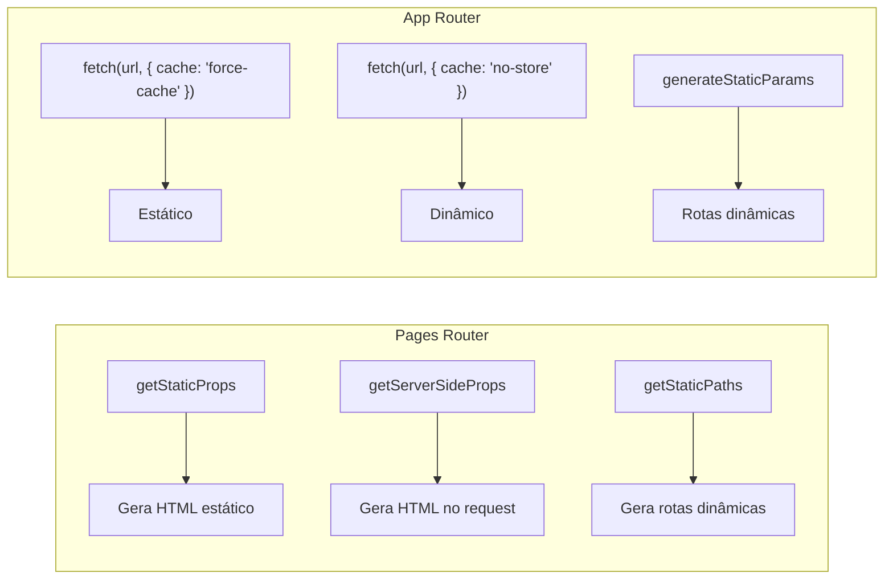

## A Mudança

O Next.js 13 introduziu o App Router, uma reescrita completa do roteador baseada em React Server Components. A partir do Next.js 14+, o App Router é o padrão recomendado para novos projetos.

## Comparação Direta

| Característica | Pages Router | App Router |
|----------------|-------------|-------------|
| **Componentes** | Client-side (tudo "use client") | Server Components (padrão) |
| **Layouts** | `_app.tsx` + `_document.tsx` | `layout.tsx` aninhados |
| **Loading** | `getStaticProps` bloqueia | `loading.tsx` + Suspense |
| **Data Fetching** | `getServerSideProps` / `getStaticProps` | `fetch` direto + cache |
| **SEO** | `next/head` | `generateMetadata` + `metadata` |
| **Streaming** | Manual com `ReactDOMServer.renderToPipeableStream` | Nativo com Suspense |
| **Middleware** | `_middleware.ts` | `middleware.ts` (único arquivo) |

## Layouts Aninhados

No App Router, layouts podem ser aninhados naturalmente pela estrutura de pastas:

```
app/
├── layout.tsx           # Layout raiz
├── dashboard/
│   ├── layout.tsx       # Layout do dashboard
│   ├── settings/
│   │   └── page.tsx     # Herda dashboard layout
│   └── page.tsx
└── page.tsx
```

```tsx
// app/dashboard/layout.tsx
export default function DashboardLayout({
  children,
}: {
  children: React.ReactNode;
}) {
  return (
    <section>
      <Sidebar />
      <main>{children}</main>
    </section>
  );
}
```

## Server Components vs Client Components

```tsx
// app/artigo/[slug]/page.tsx — Server Component (padrão)
import { getArtigo } from "@/lib/api";
import Comentarios from "./Comentarios"; // Client Component

export async function generateMetadata({ params }) {
  const artigo = await getArtigo(params.slug);
  return { title: artigo.title };
}

export default async function ArtigoPage({ params }) {
  const artigo = await getArtigo(params.slug);

  return (
    <article>
      <h1>{artigo.title}</h1>
      <div dangerouslySetInnerHTML={{ __html: artigo.body }} />
      <Suspense fallback={<p>Carregando comentários...</p>}>
        <Comentarios slug={params.slug} />
      </Suspense>
    </article>
  );
}
```

```tsx
// app/artigo/[slug]/Comentarios.tsx — Client Component
"use client";
import { useState } from "react";

export default function Comentarios({ slug }: { slug: string }) {
  const [comentarios, setComentarios] = useState([]);

  return (
    <section>
      {comentarios.map((c) => <p key={c.id}>{c.texto}</p>)}
    </section>
  );
}
```

## Data Fetching



## Stream com Suspense

```tsx
// app/produtos/page.tsx
import { Suspense } from "react";
import ListaProdutos from "./ListaProdutos";
import ListaCategorias from "./ListaCategorias";

export default function ProdutosPage() {
  return (
    <div>
      <h1>Produtos</h1>
      <Suspense fallback={<p>Carregando categorias...</p>}>
        {/* Streama assim que os dados ficam prontos */}
        <ListaCategorias />
      </Suspense>
      <Suspense fallback={<div className="grid grid-cols-3 gap-4"><Skeleton /></div>}>
        <ListaProdutos />
      </Suspense>
    </div>
  );
}
```

## Metadata

```tsx
// Pages Router
import Head from "next/head";

export default function Pagina() {
  return (
    <Head>
      <title>Meu Site</title>
      <meta name="description" content="..." />
    </Head>
  );
}
```

```tsx
// App Router
import type { Metadata } from "next";

export const metadata: Metadata = {
  title: "Meu Site",
  description: "...",
};

// Ou dinâmico:
export async function generateMetadata({ params }) {
  const data = await getData(params.slug);
  return { title: data.title, openGraph: { images: [...] } };
}
```

## Quando Migrar

| Cenário | Recomendação |
|---------|-------------|
| Projeto novo | ✅ App Router |
| Pages Router existente, pequeno | ✅ Migrar |
| Pages Router existente, grande | ⏸ Avaliar gradualmente |
| Precisa de i18n complexo | ⚠️ `next-intl` suporta bem |
| Plugins Webpack customizados | ⚠️ Verificar compatibilidade |

## Conclusão

O App Router não é apenas um novo roteador — é uma nova mentalidade. Server Components, streaming e layouts aninhados mudam a forma de pensar o frontend. Para projetos novos, comece com ele. Para projetos existentes, migre gradualmente.
