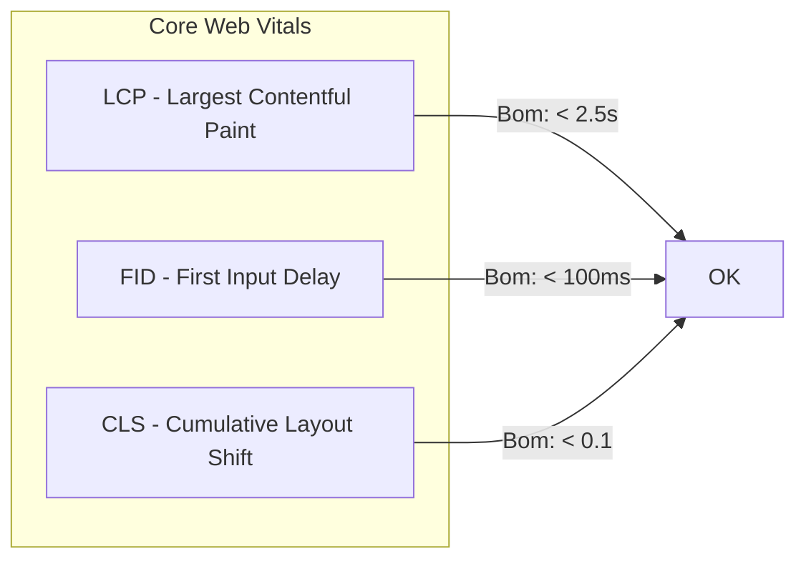

## Por Que Performance Importa

- **53%** dos usuários abandonam um site que demora mais de 3s para carregar
- **1s** de atraso reduz conversões em **7%**
- Google usa Core Web Vitals como fator de ranqueamento

## Core Web Vitals



| Métrica | O que mede | Bom | Precisa melhorar | Ruim |
|---------|-----------|-----|------------------|------|
| **LCP** | Carregamento do maior elemento | ≤ 2.5s | 2.5s - 4.0s | > 4.0s |
| **FID** | Tempo até ser interativo | ≤ 100ms | 100ms - 300ms | > 300ms |
| **CLS** | Estabilidade visual | ≤ 0.1 | 0.1 - 0.25 | > 0.25 |

## Otimizações Práticas

### 1. Imagens Otimizadas

```tsx
import Image from "next/image";

// ✅ Next.js Image otimiza automático
<Image
  src="/banner.jpg"
  alt="Banner"
  width={1200}
  height={630}
  priority // LCP: use priority no hero
  sizes="(max-width: 768px) 100vw, 1200px"
/>
```

```css
/* ✅ Lazy loading nativo para imagens abaixo da dobra */
img[loading="lazy"] {
  /* o browser já faz o trabalho pesado */
}
```

### 2. Code Splitting

```tsx
// ❌ Ruim: importa tudo de uma vez
import Chart from "./Chart";
import Table from "./Table";

// ✅ Bom: lazy loading por rota ou visibilidade
const Chart = dynamic(() => import("./Chart"), {
  loading: () => <Skeleton />,
  ssr: false, // se o componente usa window/document
});

// ✅ Lazy loading condicional
function Dashboard() {
  const [showChart, setShowChart] = useState(false);

  return (
    <div>
      <button onClick={() => setShowChart(true)}>Mostrar Gráfico</button>
      {showChart && (
        <Suspense fallback={<Skeleton />}>
          <Chart />
        </Suspense>
      )}
    </div>
  );
}
```

### 3. Bundle Analysis

```bash
# Adicione ao package.json
npm install @next/bundle-analyzer

# next.config.ts
const withBundleAnalyzer = require("@next/bundle-analyzer")({
  enabled: process.env.ANALYZE === "true",
});
module.exports = withBundleAnalyzer({});
```

```bash
ANALYZE=true npm run build
```

### 4. Fontes Otimizadas

```tsx
import { Geist } from "next/font/google";

const geist = Geist({
  subsets: ["latin"],
  display: "swap", // ✅ evita FOIT (Flash of Invisible Text)
});
```

### 5. CSS Crítico

```html
<!-- Render-blocking CSS carregado antes do conteúdo -->
<head>
  <style>
    /* CSS crítico para o hero e layout inicial */
    body { margin: 0; font-family: sans-serif; }
    .hero { display: flex; min-height: 60vh; }
  </style>
  <link rel="stylesheet" href="/styles.css" media="print" onload="this.media='all'">
</head>
```

### 6. Preload e Prefetch

```html
<!-- Recursos críticos para o LCP -->
<link rel="preload" href="/hero.webp" as="image" />
<link rel="preload" href="/font.woff2" as="font" type="font/woff2" crossorigin />

<!-- Navegação futura -->
<link rel="prefetch" href="/produtos" as="document" />
```

## Ferramentas de Medição

| Ferramenta | O que mede | Como usar |
|-----------|-----------|-----------|
| **Lighthouse** | Performance geral | `npx lighthouse https://site.com` |
| **Web Vitals Extension** | Core Web Vitals em tempo real | Extensão Chrome |
| **PageSpeed Insights** | Dados de campo + laboratório | pagespeed.web.dev |
| **Chrome DevTools** | Network, Performance, Coverage | F12 no navegador |
| **Sentry / Vercel Analytics** | Monitoramento em produção | SDK de terceiros |

## Check List de Performance

```markdown
- [ ] Imagens otimizadas (WebP/AVIF, dimensões corretas, lazy loading)
- [ ] Fontes com `display: swap`
- [ ] Code splitting em rotas e componentes pesados
- [ ] Bundle analysis rodado a cada PR
- [ ] CSS crítico inline
- [ ] Preload de recursos do LCP
- [ ] Server Components (evitar JS no cliente)
- [ ] Cache de dados com `fetch` + revalidação
- [ ] Lighthouse > 90 em mobile e desktop
```

## Conclusão

Performance não é feature — é requisito. Monitore Core Web Vitals desde o início, otimize imagens, split o código e use ferramentas de medição continuamente. Cada milissegundo conta.
