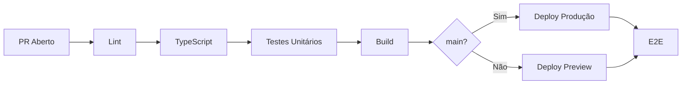

## Por Que Pipeline no Frontend?

Normalmente a gente faz pipelines só para o backend. No frontend não é tão comum, mas para uma aplicação escalável é sempre bom prevenir do que remediar. Um pipeline de CI/CD para frontend automatiza:

- **Lint e formatação** — código consistente
- **Testes** — não quebrar funcionalidades existentes
- **TypeScript** — tipos seguros em cada PR
- **Build** — garantir que compila
- **Deploy** — publicado automaticamente

## Pipeline Completo com GitHub Actions

```yaml
# .github/workflows/frontend.yml
name: Frontend CI/CD

on:
  push:
    branches: [main]
  pull_request:
    branches: [main]

jobs:
  quality:
    name: Lint e Testes
    runs-on: ubuntu-latest

    steps:
      - uses: actions/checkout@v4

      - uses: actions/setup-node@v4
        with:
          node-version: 20
          cache: "npm"

      - run: npm ci

      - name: Lint
        run: npm run lint

      - name: Type Check
        run: npm run typecheck

      - name: Testes
        run: npm run test -- --coverage

      - name: Upload Coverage
        uses: actions/upload-artifact@v4
        with:
          name: coverage
          path: coverage/

  build:
    name: Build
    needs: quality
    runs-on: ubuntu-latest

    steps:
      - uses: actions/checkout@v4
      - uses: actions/setup-node@v4
        with:
          node-version: 20
          cache: "npm"

      - run: npm ci
      - run: npm run build

      - name: Upload Build
        uses: actions/upload-pages-artifact@v3
        with:
          path: out/

  deploy:
    name: Deploy
    if: github.ref == 'refs/heads/main'
    needs: build
    runs-on: ubuntu-latest

    permissions:
      pages: write
      id-token: write

    environment:
      name: github-pages
      url: ${{ steps.deployment.outputs.page_url }}

    steps:
      - name: Deploy to GitHub Pages
        id: deployment
        uses: actions/deploy-pages@v4
```

## Pipeline para Vercel

```yaml
name: Vercel Preview
on:
  pull_request:
    branches: [main]

jobs:
  preview:
    runs-on: ubuntu-latest
    steps:
      - uses: actions/checkout@v4
      - uses: amondnet/vercel-action@v25
        with:
          vercel-token: ${{ secrets.VERCEL_TOKEN }}
          vercel-org-id: ${{ secrets.VERCEL_ORG_ID }}
          vercel-project-id: ${{ secrets.VERCEL_PROJECT_ID }}
          github-comment: true
```

## Pipeline para S3 + CloudFront

```yaml
deploy-s3:
  runs-on: ubuntu-latest
  if: github.ref == 'refs/heads/main'

  steps:
    - uses: actions/checkout@v4

    - name: Configure AWS Credentials
      uses: aws-actions/configure-aws-credentials@v4
      with:
        aws-access-key-id: ${{ secrets.AWS_ACCESS_KEY_ID }}
        aws-secret-access-key: ${{ secrets.AWS_SECRET_ACCESS_KEY }}
        aws-region: us-east-1

    - run: npm ci && npm run build

    - name: Sync to S3
      run: aws s3 sync out/ s3://meu-site-frontend --delete

    - name: Invalidate CloudFront
      run: aws cloudfront create-invalidation
        --distribution-id ${{ secrets.CF_DISTRIBUTION_ID }}
        --paths "/*"
```

## O Que Validar no Pipeline



### Etapas Obrigatórias

| Etapa | Comando | O que previne |
|-------|---------|---------------|
| **Lint** | `npm run lint` | Erros de sintaxe, más práticas |
| **Type Check** | `npm run typecheck` | Tipos inconsistentes |
| **Testes** | `npm run test` | Regressão de funcionalidades |
| **Build** | `npm run build` | Erro de compilação |
| **Bundle Analysis** | `npm run analyze` | Aumento inesperado de bundle |

### Etapas Opcionais

| Etapa | Benefício |
|-------|-----------|
| **Lighthouse CI** | Performance em cada PR |
| **Testes E2E** | Fluxos críticos do usuário |
| **Visual Regression** | Screenshots comparados |
| **Acessibilidade (axe)** | Quebra se a11y piorar |

## GitHub Actions para Este Projeto (Next.js DevVault)

```yaml
name: DevVault CI
on:
  pull_request:
    branches: [main]

jobs:
  build:
    runs-on: ubuntu-latest
    steps:
      - uses: actions/checkout@v4
      - uses: actions/setup-node@v4
        with:
          node-version: 20
          cache: "npm"

      - run: npm ci

      - name: Lint
        run: npm run lint

      - name: TypeScript
        run: npx tsc --noEmit

      - name: Build
        run: npm run build
```

## Conclusão

Pipeline no frontend não é luxo — é garantia de qualidade. Prevenir um deploy quebrado em produção é sempre mais barato que remediar depois. Comece com lint + build em todos os PRs, e adicione testes, análise de bundle e deploys automáticos conforme o projeto cresce.
