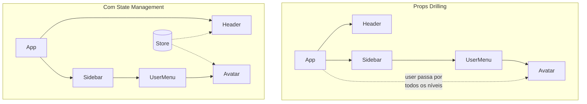
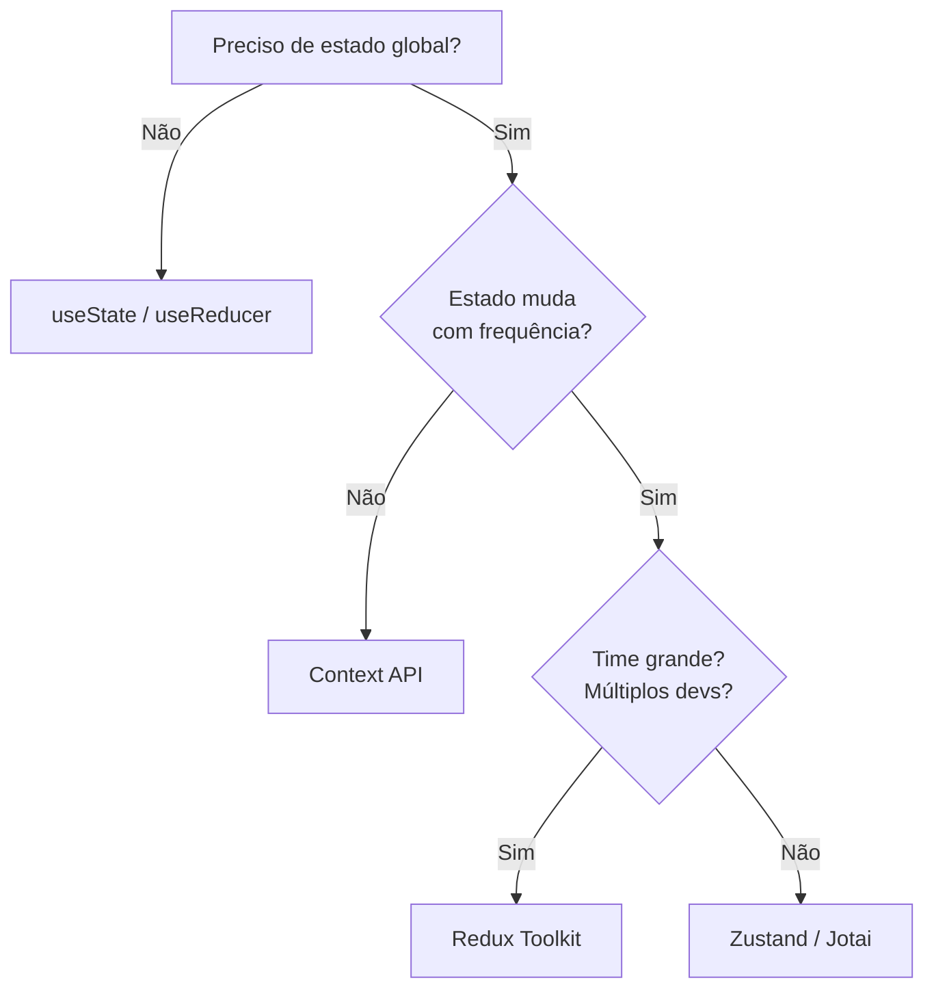

## O Problema

Conforme uma aplicação React cresce, o estado precisa ser compartilhado entre componentes distantes na árvore. Passar props manualmente (prop drilling) se torna inviável. Cada solução de state management resolve isso de forma diferente.



## Comparação das Ferramentas

| Ferramenta | Bundle | Complexidade | Quando usar |
|-----------|--------|-------------|-------------|
| **useState + props** | 0 KB | Baixa | Estado local, 1-2 níveis |
| **Context API** | 0 KB | Média | Tema, idioma, auth (poucas atualizações) |
| **Zustand** | ~1 KB | Baixa | 90% dos casos de estado global |
| **Jotai** | ~3 KB | Baixa | Estado atômico, derivado |
| **Redux Toolkit** | ~12 KB | Alta | Aplicações grandes, time grande, middleware |

## Context API

Nativa do React, ideal para estado que muda com pouca frequência:

```tsx
import { createContext, useContext, useState } from "react";

type Theme = "dark" | "light";

const ThemeContext = createContext<{
  theme: Theme;
  toggle: () => void;
} | null>(null);

export function ThemeProvider({ children }: { children: React.ReactNode }) {
  const [theme, setTheme] = useState<Theme>("dark");

  return (
    <ThemeContext.Provider value={{
      theme,
      toggle: () => setTheme(t => t === "dark" ? "light" : "dark"),
    }}>
      {children}
    </ThemeContext.Provider>
  );
}

export function useTheme() {
  const ctx = useContext(ThemeContext);
  if (!ctx) throw new Error("useTheme deve estar dentro de ThemeProvider");
  return ctx;
}
```

**⚠️ Cuidado:** Context dispara re-render em todos os consumidores, mesmo que só uma parte do estado mude.

## Zustand

Simples, performático e sem boilerplate:

```tsx
import { create } from "zustand";

type CartStore = {
  items: Item[];
  total: number;
  addItem: (item: Item) => void;
  removeItem: (id: string) => void;
  clear: () => void;
};

export const useCart = create<CartStore>((set, get) => ({
  items: [],
  total: 0,
  addItem: (item) => set((state) => ({
    items: [...state.items, item],
    total: state.total + item.price,
  })),
  removeItem: (id) => set((state) => ({
    items: state.items.filter((i) => i.id !== id),
    total: state.total - state.items.find((i) => i.id === id)!.price,
  })),
  clear: () => set({ items: [], total: 0 }),
}));

// Uso no componente:
function Cart() {
  const { items, total, removeItem } = useCart();
  // ou selecionar apenas o necessário:
  // const total = useCart((s) => s.total);
  return (
    <div>
      {items.map((item) => (
        <div key={item.id}>
          {item.name} - R${item.price}
          <button onClick={() => removeItem(item.id)}>Remover</button>
        </div>
      ))}
      <p>Total: R${total}</p>
    </div>
  );
}
```

## Jotai

Estado atômico — cada "átomo" é uma unidade mínima de estado:

```tsx
import { atom, useAtom } from "jotai";

const userAtom = atom<User | null>(null);
const cartAtom = atom<Item[]>([]);

// Átomo derivado (computed)
const cartTotalAtom = atom((get) =>
  get(cartAtom).reduce((acc, item) => acc + item.price, 0)
);

// Átomo com ação async
const userAsyncAtom = atom(async (get) => {
  const id = get(userAtom)?.id;
  if (!id) return null;
  const res = await fetch(`/api/users/${id}`);
  return res.json();
});

function UserProfile() {
  const [user] = useAtom(userAtom);
  const [total] = useAtom(cartTotalAtom);
  return <div>{user?.name} - Carrinho: R${total}</div>;
}
```

## Redux Toolkit

Para aplicações de grande escala:

```tsx
import { createSlice, configureStore } from "@reduxjs/toolkit";
import { useSelector, useDispatch } from "react-redux";

const cartSlice = createSlice({
  name: "cart",
  initialState: { items: [] as Item[], status: "idle" },
  reducers: {
    addItem: (state, action) => {
      state.items.push(action.payload);
    },
    removeItem: (state, action) => {
      state.items = state.items.filter((i) => i.id !== action.payload);
    },
  },
});

export const { addItem, removeItem } = cartSlice.actions;

const store = configureStore({
  reducer: {
    cart: cartSlice.reducer,
    user: userSlice.reducer,
  },
});

function Cart() {
  const items = useSelector((state: RootState) => state.cart.items);
  const dispatch = useDispatch();
  return (
    <button onClick={() => dispatch(addItem({ id: "1", name: "Livro" }))}>
      Adicionar
    </button>
  );
}
```

## Árvore de Decisão



## Conclusão

Não existe bala de prata. Comece com `useState`, evolua para Context quando necessário, e só adicione Zustand ou Redux quando o estado global realmente justificar. A maioria dos projetos não precisa de Redux.
