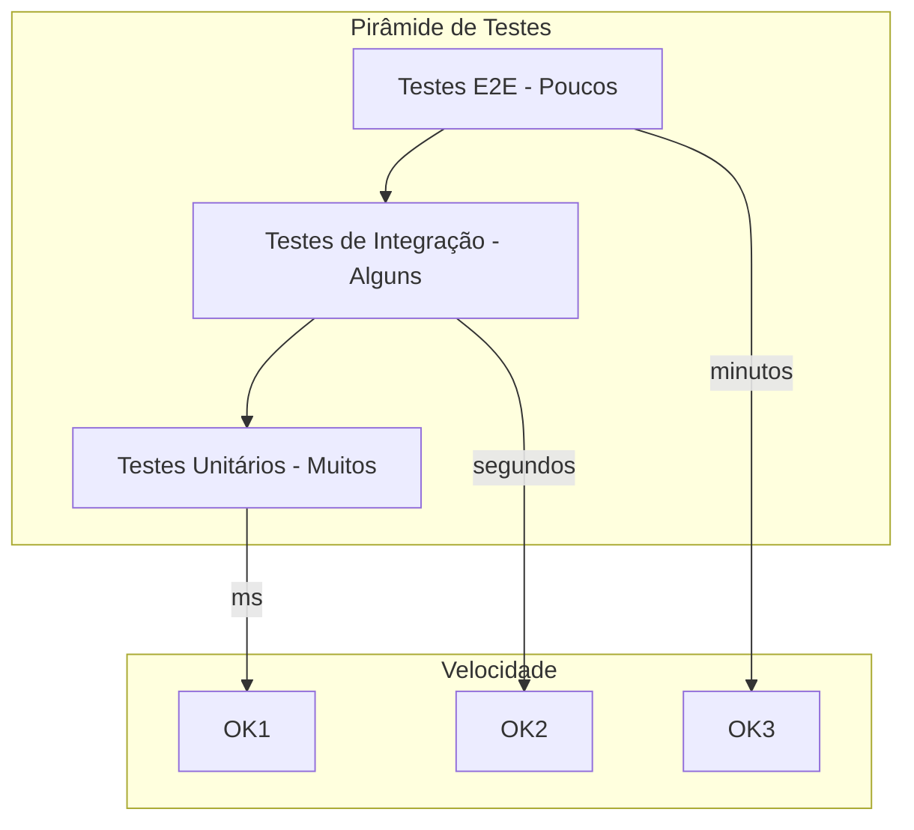
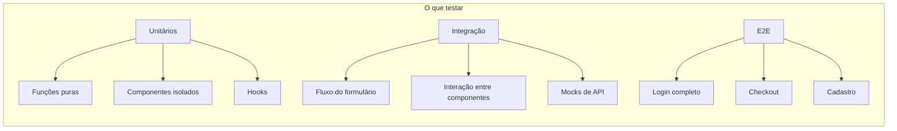

## A Pirâmide de Testes no Frontend



| Camada | Ferramenta | O que testar | Quantidade |
|--------|-----------|-------------|------------|
| **Unitários** | Jest + Testing Library | Hooks, utils, componentes isolados | 70% |
| **Integração** | Testing Library | Comportamento de página/seção | 20% |
| **E2E** | Playwright / Cypress | Fluxos completos do usuário | 10% |

## Testes Unitários com Jest e Testing Library

### Testando Componentes

```tsx
import { render, screen, fireEvent } from "@testing-library/react";
import userEvent from "@testing-library/user-event";
import Button from "./Button";

describe("Button", () => {
  it("renderiza o label corretamente", () => {
    render(<Button label="Clique aqui" onClick={() => {}} />);
    expect(screen.getByText("Clique aqui")).toBeInTheDocument();
  });

  it("chama onClick quando clicado", async () => {
    const onClick = jest.fn();
    render(<Button label="OK" onClick={onClick} />);

    await userEvent.click(screen.getByText("OK"));
    expect(onClick).toHaveBeenCalledTimes(1);
  });

  it("não chama onClick quando desabilitado", async () => {
    const onClick = jest.fn();
    render(<Button label="OK" onClick={onClick} disabled />);

    await userEvent.click(screen.getByText("OK"));
    expect(onClick).not.toHaveBeenCalled();
  });

  it("aplica variante correta de estilo", () => {
    const { container } = render(
      <Button label="Danger" variant="danger" onClick={() => {}} />
    );
    expect(container.firstChild).toHaveClass("btn-danger");
  });
});
```

### Testando Hooks

```tsx
import { renderHook, act } from "@testing-library/react";
import { useCounter } from "./useCounter";

describe("useCounter", () => {
  it("inicia com valor padrão", () => {
    const { result } = renderHook(() => useCounter());
    expect(result.current.count).toBe(0);
  });

  it("incrementa o contador", () => {
    const { result } = renderHook(() => useCounter());
    act(() => result.current.increment());
    expect(result.current.count).toBe(1);
  });

  it("aceita valor inicial", () => {
    const { result } = renderHook(() => useCounter(10));
    expect(result.current.count).toBe(10);
  });
});
```

## Testes de Integração

Testam fluxos reais do usuário combinando múltiplos componentes:

```tsx
import { render, screen, waitFor } from "@testing-library/react";
import userEvent from "@testing-library/user-event";
import CadastroForm from "./CadastroForm";

describe("CadastroForm", () => {
  beforeEach(() => {
    fetchMock.resetMocks();
  });

  it("envia formulário com sucesso", async () => {
    fetchMock.mockResponseOnce(JSON.stringify({ id: "123" }));

    render(<CadastroForm />);

    await userEvent.type(screen.getByLabelText("Nome"), "João Silva");
    await userEvent.type(screen.getByLabelText("Email"), "joao@email.com");
    await userEvent.type(screen.getByLabelText("Senha"), "123456");
    await userEvent.click(screen.getByText("Cadastrar"));

    await waitFor(() => {
      expect(screen.getByText("Cadastro realizado!")).toBeInTheDocument();
    });
  });

  it("mostra erro de validação quando email inválido", async () => {
    render(<CadastroForm />);

    await userEvent.type(screen.getByLabelText("Email"), "email-invalido");
    await userEvent.click(screen.getByText("Cadastrar"));

    expect(screen.getByText("Email inválido")).toBeInTheDocument();
  });

  it("desabilita botão durante envio", async () => {
    fetchMock.mockResponseOnce(
      () => new Promise((resolve) => setTimeout(() => resolve({ body: "ok" }), 1000))
    );

    render(<CadastroForm />);

    await userEvent.type(screen.getByLabelText("Nome"), "João Silva");
    await userEvent.type(screen.getByLabelText("Email"), "joao@email.com");
    await userEvent.type(screen.getByLabelText("Senha"), "123456");
    await userEvent.click(screen.getByText("Cadastrar"));

    expect(screen.getByText("Cadastrar")).toBeDisabled();
  });
});
```

## Testes E2E com Playwright

```ts
// tests/e2e/carrinho.spec.ts
import { test, expect } from "@playwright/test";

test("fluxo completo de compra", async ({ page }) => {
  // Navegar para a página inicial
  await page.goto("/");

  // Buscar um produto
  await page.fill('[data-testid="search"]', "Notebook");
  await page.click('[data-testid="search-button"]');

  // Clicar no produto
  await page.click("text=Notebook Pro X1");

  // Adicionar ao carrinho
  await page.click("text=Adicionar ao Carrinho");

  // Verificar carrinho
  await page.click('[data-testid="cart-icon"]');
  await expect(page.locator('[data-testid="cart-item"]')).toHaveCount(1);

  // Finalizar compra
  await page.click("text=Finalizar Compra");
  await page.fill('[name="card"]', "4111111111111111");
  await page.click("text=Pagar");

  // Confirmar sucesso
  await expect(page.locator("text=Compra realizada!")).toBeVisible();
});
```

## O Que Testar em Cada Camada



| Categoria | O que testar | O que não testar |
|-----------|-------------|------------------|
| **Componentes** | Render, interações, estados vazio/erro/carregando | Estilos CSS |
| **Hooks** | Estado inicial, ações, side effects | Implementação interna |
| **Utils/Helpers** | Toda lógica de negócio | - |
| **Páginas** | Fluxo completo, navegação | Layout exato |

## Conclusão

Testes no frontend não precisam ser exaustivos. Siga a pirâmide: muitos unitários, alguns de integração, poucos E2E. Teste comportamento, não implementação. E lembre-se: código sem teste é código legado desde o primeiro commit.
