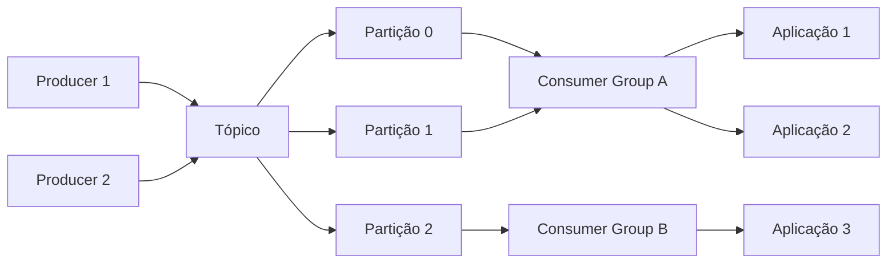

## O que é o Apache Kafka?

Apache Kafka é uma plataforma distribuída de stream de eventos. Publicado pela LinkedIn em 2011, é usado para pipelines de dados em tempo real, ingestão de eventos e integração entre microsserviços.

## Conceitos Fundamentais



| Componente | Descrição |
|------------|-----------|
| **Producer** | Publica mensagens em tópicos |
| **Consumer** | Assina tópicos e processa mensagens |
| **Tópico** | Canal lógico de mensagens |
| **Partição** | Divisão física do tópico (paralelismo) |
| **Broker** | Servidor Kafka no cluster |
| **Consumer Group** | Grupo de consumidores que divide as partições |
| **Offset** | ID único de cada mensagem na partição |

## Producer em Java

```java
import org.apache.kafka.clients.producer.KafkaProducer;
import org.apache.kafka.clients.producer.ProducerRecord;
import org.apache.kafka.clients.producer.RecordMetadata;
import java.util.Properties;
import java.util.concurrent.Future;

public class PedidoProducer {

    public static void main(String[] args) throws Exception {
        Properties props = new Properties();
        props.put("bootstrap.servers", "localhost:9092");
        props.put("key.serializer",
            "org.apache.kafka.common.serialization.StringSerializer");
        props.put("value.serializer",
            "org.apache.kafka.common.serialization.StringSerializer");
        props.put("acks", "all");
        props.put("retries", 3);

        try (KafkaProducer<String, String> producer = new KafkaProducer<>(props)) {
            String pedidoJson = """
                {"pedidoId": "123", "cliente": "João", "total": 250.00}""";

            Future<RecordMetadata> future = producer.send(
                new ProducerRecord<>("pedidos", "123", pedidoJson));

            RecordMetadata meta = future.get();
            System.out.println("Enviado para partição " + meta.partition() +
                " | offset " + meta.offset());
        }
    }
}
```

## Consumer em Java

```java
import org.apache.kafka.clients.consumer.ConsumerRecord;
import org.apache.kafka.clients.consumer.ConsumerRecords;
import org.apache.kafka.clients.consumer.KafkaConsumer;
import java.time.Duration;
import java.util.List;
import java.util.Properties;

public class PedidoConsumer {

    public static void main(String[] args) {
        Properties props = new Properties();
        props.put("bootstrap.servers", "localhost:9092");
        props.put("group.id", "processador-pedidos");
        props.put("key.deserializer",
            "org.apache.kafka.common.serialization.StringDeserializer");
        props.put("value.deserializer",
            "org.apache.kafka.common.serialization.StringDeserializer");
        props.put("auto.offset.reset", "earliest");
        props.put("enable.auto.commit", "false");

        try (KafkaConsumer<String, String> consumer =
                new KafkaConsumer<>(props)) {
            consumer.subscribe(List.of("pedidos"));

            while (true) {
                ConsumerRecords<String, String> records =
                    consumer.poll(Duration.ofMillis(100));

                for (ConsumerRecord<String, String> record : records) {
                    System.out.printf("Processando pedido %s: %s%n",
                        record.key(), record.value());

                    // Processar...
                    processarPedido(record.value());

                    // Commit manual
                    consumer.commitSync();
                }
            }
        }
    }

    private static void processarPedido(String json) {
        System.out.println("Pedido processado: " + json);
    }
}
```

## Garantias de Entrega

| Garantia | Descrição | acks |
|----------|-----------|------|
| At most once | Mensagem pode ser perdida, nunca reentregue | 0 |
| At least once | Mensagem nunca perdida, pode ser reentregue | 1 |
| Exactly once | Mensagem entregue exatamente uma vez | all + idempotência |

## Configuração de Cluster

```yaml
# server.properties
broker.id=1
listeners=PLAINTEXT://:9092
log.dirs=/data/kafka
num.partitions=3
offsets.topic.replication.factor=3
transaction.state.log.replication.factor=3
transaction.state.log.min.isr=2
default.replication.factor=3
min.insync.replicas=2
```

## Kafka Streams (Processamento)

```java
import org.apache.kafka.streams.KafkaStreams;
import org.apache.kafka.streams.StreamsBuilder;
import org.apache.kafka.streams.kstream.KStream;
import java.util.Properties;

public class ContagemVendas {

    public static void main(String[] args) {
        Properties props = new Properties();
        props.put("application.id", "contagem-vendas");
        props.put("bootstrap.servers", "localhost:9092");

        StreamsBuilder builder = new StreamsBuilder();
        KStream<String, String> vendas = builder.stream("vendas");

        vendas
            .filter((chave, valor) -> valor.contains("finalizado"))
            .groupBy((chave, valor) -> extrairCategoria(valor))
            .count()
            .toStream()
            .peek((cat, total) ->
                System.out.println(cat + ": " + total + " vendas"))
            .to("total-vendas-por-categoria");

        new KafkaStreams(builder.build(), props).start();
    }

    private static String extrairCategoria(String venda) {
        return venda.contains("eletrônico") ? "eletronicos" : "outros";
    }
}
```

## Casos de Uso

- **Pipelines de dados:** Ingestão de logs, métricas, events
- **Microsserviços:** Coreografia entre serviços via eventos
- **Event Sourcing:** Armazenamento do histórico de eventos
- **Stream Processing:** Agregações em tempo real
- **Log centralizado:** Agregação de logs distribuídos

## Conclusão

Kafka é a escolha ideal para pipelines de alta throughput, replay de mensagens e processamento de streams. É mais complexo que um message broker tradicional, mas oferece capacidades únicas de armazenamento e reprocessamento.
