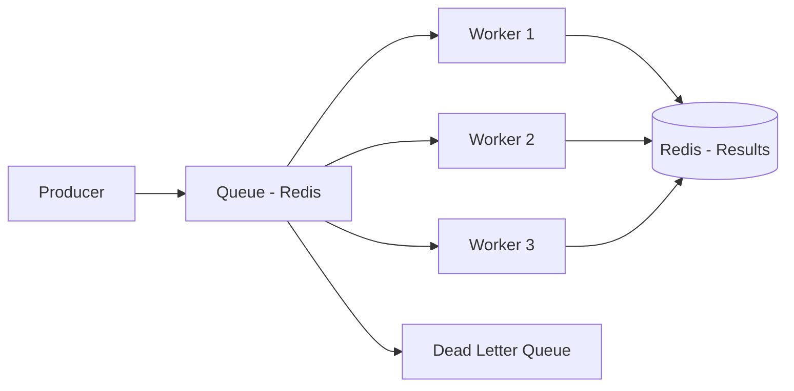

## O que é o BullMQ?

BullMQ é uma biblioteca de filas para Node.js construída sobre Redis. Leve e rápida, é amplamente usada para processamento assíncrono de jobs, agendamento de tarefas e integração entre serviços.

## Arquitetura



## Producer em Node.js

```javascript
const { Queue } = require('bullmq');

const connection = {
  host: 'localhost',
  port: 6379,
};

const filaEmail = new Queue('envio-email', { connection });

async function agendarEmail() {
  await filaEmail.add('email-boas-vindas', {
    to: 'usuario@email.com',
    subject: 'Bem-vindo!',
    body: 'Obrigado por se cadastrar.',
    template: 'boas-vindas',
  }, {
    attempts: 3,
    backoff: {
      type: 'exponential',
      delay: 2000,
    },
    removeOnComplete: {
      age: 3600, // Remove após 1h
      count: 100,
    },
  });

  await filaEmail.add('email-recuperacao-senha', {
    to: 'outro@email.com',
    subject: 'Recuperação de Senha',
    token: 'abc-123-def',
  }, {
    delay: 1000, // Atraso de 1s
    priority: 10, // Prioridade (menor = mais prioritário)
  });
}

agendarEmail();
```

## Worker em Node.js

```javascript
const { Worker } = require('bullmq');

const connection = {
  host: 'localhost',
  port: 6379,
};

const worker = new Worker('envio-email', async (job) => {
  console.log(`Processando job ${job.id}: ${job.name}`);

  const { to, subject, body } = job.data;

  switch (job.name) {
    case 'email-boas-vindas':
      await enviarEmailBoasVindas(to, subject, body);
      break;
    case 'recuperacao-senha':
      await enviarEmailRecuperacao(to, job.data.token);
      break;
    default:
      throw new Error(`Tipo desconhecido: ${job.name}`);
  }

  return { status: 'enviado', destinatario: to };
}, {
  connection,
  concurrency: 5, // Processa 5 jobs em paralelo
  limiter: {
    max: 10,
    duration: 1000, // Máx 10 jobs por segundo
  },
});

worker.on('completed', (job, result) => {
  console.log(`Job ${job.id} concluído:`, result);
});

worker.on('failed', (job, err) => {
  console.error(`Job ${job.id} falhou:`, err.message);
});

async function enviarEmailBoasVindas(to, subject, body) {
  console.log(`Enviando e-mail de boas-vindas para ${to}`);
  // Integração com SES, SendGrid, etc.
}

async function enviarEmailRecuperacao(to, token) {
  console.log(`Enviando recuperação de senha para ${to}`);
}
```

## Processamento em Java via BullMQ

BullMQ é nativamente Node.js, mas você pode produzir mensagens de qualquer linguagem:

```java
import redis.clients.jedis.Jedis;
import java.util.UUID;

public class BullMQProducer {

    public static void main(String[] args) {
        try (Jedis jedis = new Jedis("localhost", 6379)) {
            String jobId = UUID.randomUUID().toString();
            String payload = """
                {"to": "java@email.com", "subject": "Olá do Java!", "body": "Mensagem via BullMQ"}""";

            // BullMQ armazena jobs no Redis com chave bull:<queue>:<id>
            jedis.hset("bull:envio-email:" + jobId, Map.of(
                "name", "email-boas-vindas",
                "data", payload,
                "opts", "{\"attempts\": 3}",
                "timestamp", String.valueOf(System.currentTimeMillis()),
                "delay", "0",
                "priority", "0"
            ));

            // Adicionar à lista de espera
            jedis.zadd("bull:envio-email:wait",
                System.currentTimeMillis(),
                jobId);

            System.out.println("Job criado no BullMQ via Redis: " + jobId);
        }
    }
}
```

## Recursos Avançados

### Jobs Agendados (Cron)

```javascript
const { QueueScheduler } = require('bullmq');

const scheduler = new QueueScheduler('relatorios', { connection });

// Job recorrente a cada 30 minutos
await filaRelatorios.add('gerar-relatorio-vendas', {
  periodo: 'ultimos-30-min',
}, {
  repeat: {
    every: 30 * 60 * 1000,
    immediately: true,
  },
});

// Job diário às 8h
await filaRelatorios.add('gerar-relatorio-diario', {}, {
  repeat: {
    pattern: '0 8 * * *', // Cron expression
  },
});
```

### Filas com Prioridade

```javascript
await filaPedidos.add('pedido-vip', pedidoVip, { priority: 1 });
await filaPedidos.add('pedido-normal', pedidoNormal, { priority: 10 });
```

### Sandbox para Jobs Complexos

```javascript
// worker.js separado — executa em processo filho
const { Worker } = require('bullmq');
new Worker('processamento-pesado', __dirname + '/processor.js', {
  connection,
  useWorkerThreads: true,
});
```

```javascript
// processor.js — executado em sandbox
module.exports = async (job) => {
  const { dados } = job.data;
  // Processamento pesado...
  return resultado;
};
```

## Casos de Uso

- **Envio de e-mails e notificações:** Disparo assíncrono sem bloquear a requisição
- **Processamento de arquivos:** Upload → fila → processamento → resultado
- **Geração de relatórios:** Jobs agendados que geram PDFs/CSVs
- **Web scraping:** Jobs em fila para crawlers e scrapers
- **Integrações:** Bridge entre webhooks e sistemas internos
- **Rate limiting:** Controle de taxa para APIs externas

## Conclusão

BullMQ é a melhor opção para times Node.js que já usam Redis. Simples de configurar, com suporte a prioridade, repetição, agendamento e sandbox — perfeito para processamento assíncrono sem overhead de infraestrutura.
