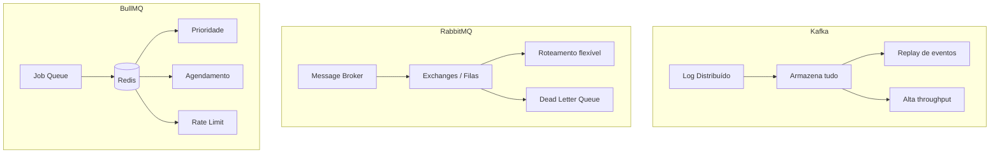
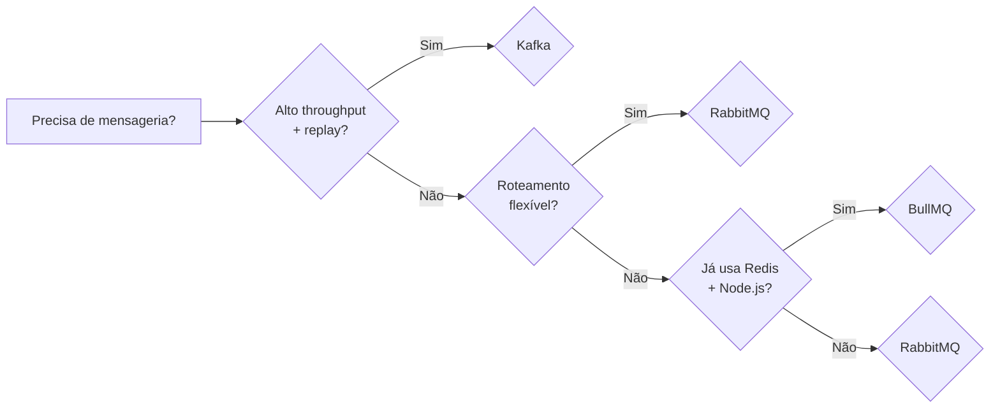
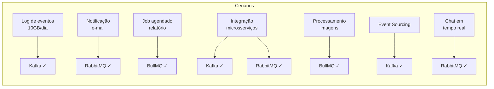

## Visão Geral

Três ferramentas dominantes de mensageria, cada uma com seu propósito e filosofia:



## Comparação Técnica

| Característica | Apache Kafka | RabbitMQ | BullMQ |
|----------------|-------------|----------|--------|
| **Tipo** | Log distribuído / Stream | Message Broker | Job Queue |
| **Protocolo** | TCP (protocolo próprio) | AMQP 0-9-1, MQTT, STOMP | Redis |
| **Armazenamento** | Disco (log) | Disco / RAM | Redis (RAM + persistência) |
| **Roteamento** | Tópicos + partições | Exchanges + routing keys | Filas nomeadas |
| **Retenção** | Configurável (tempo/tamanho) | Remove após consumo | Remove após ACK + config |
| **Replay** | Sim (reset de offset) | Limitado | Limitado |
| **Throughput** | ~1M msg/s (cluster) | ~50K msg/s | ~10K msg/s (Redis) |
| **Latência** | Milissegundos | Microssegundos | Milissegundos |
| **Ordem** | Garantida por partição | Garantida por fila | Garantida por fila |
| **Linguagem** | Java (nativa), multi-língua | Erlang, multi-língua | Node.js, multi-língua via Redis |
| **Operação** | Complexa (ZooKeeper/KRaft) | Simples | Mínima (só Redis) |

## Cenários Recomendados



### Kafka é ideal quando:

- Pipeline de dados com alto throughput (>100K msg/s)
- Necessidade de **replay** de eventos (reprocessar mensagens antigas)
- **Event sourcing** / armazenamento do histórico completo
- **Stream processing** (Kafka Streams, ksqlDB)
- Log centralizado e métricas em tempo real
- Integração entre múltiplos sistemas em larga escala

```java
// Kafka: Configuração típica de alta performance
Properties props = new Properties();
props.put("bootstrap.servers", "kafka-cluster:9092");
props.put("acks", "all");
props.put("batch.size", 65536);       // 64KB
props.put("linger.ms", 10);            // 10ms de espera
props.put("compression.type", "snappy");
props.put("enable.idempotence", "true");
props.put("max.in.flight.requests.per.connection", 5);
```

### RabbitMQ é ideal quando:

- Precisa de **roteamento flexível** (direct, topic, fanout, headers)
- Comunicação entre microsserviços com **exchanges complexas**
- **Tarefas assíncronas** com confirmação e rejeição
- Dead letter queue para tratamento de falhas
- Equipe pequena, precisa de algo **simples de operar**
- Latência ultrabaixa (microssegundos)

```java
// RabbitMQ: Configuração com dead letter e TTL
Map<String, Object> args = new HashMap<>();
args.put("x-dead-letter-exchange", "minha.dlx");
args.put("x-message-ttl", 30000);
args.put("x-max-priority", 10);
channel.queueDeclare("pedidos", true, false, false, args);
```

### BullMQ é ideal quando:

- Stack **Node.js** com Redis já existente
- **Job scheduling** (cron, atraso, repetição)
- **Rate limiting** para APIs externas
- **Filas com prioridade** (ex: pedidos VIP vs normal)
- Equipe pequena, quer produtividade máxima
- Prototipagem rápida sem overhead de infra

```javascript
// BullMQ: Configuração típica
const fila = new Queue('pedidos', { connection });
await fila.add('processar', data, {
  attempts: 3,
  backoff: { type: 'exponential', delay: 2000 },
  priority: 1,
  delay: 1000,
  removeOnComplete: { age: 3600 },
});
```

## Comparação de Performance



## Exemplo de Decisão Prática

Suponha que você está projetando um sistema de **e-commerce**:

| Funcionalidade | Ferramenta | Por quê |
|----------------|------------|---------|
| Log de pedidos (event sourcing) | Kafka | Replay para auditoria |
| Envio de e-mail de confirmação | RabbitMQ | Roteamento por tipo de evento |
| Geração de boleto em PDF | BullMQ | Job com prioridade e retry |
| Pipeline de recomendações | Kafka | Stream processing em tempo real |
| Notificação push mobile | RabbitMQ | Fanout para múltiplos canais |
| Atualização de estoque | Kafka | Alta throughput de eventos |

## Resumo Final

| Escolha Kafka quando... | Escolha RabbitMQ quando... | Escolha BullMQ quando... |
|------------------------|---------------------------|--------------------------|
| Precisa de replay | Precisa de roteamento | Já usa Redis |
| Alto throughput | Baixa latência | Stack Node.js |
| Stream processing | Operação simples | Job scheduling |
| Log distribuído | Exchanges complexas | Rate limiting |
| Event sourcing | DLQ e retry | Prioridade de jobs |

Não existe bala de prata. Muitos sistemas usam **duas ou três ferramentas juntas** — Kafka para o pipeline principal, RabbitMQ para roteamento de mensagens, e BullMQ para jobs agendados. O importante é entender o problema antes de escolher a ferramenta.
