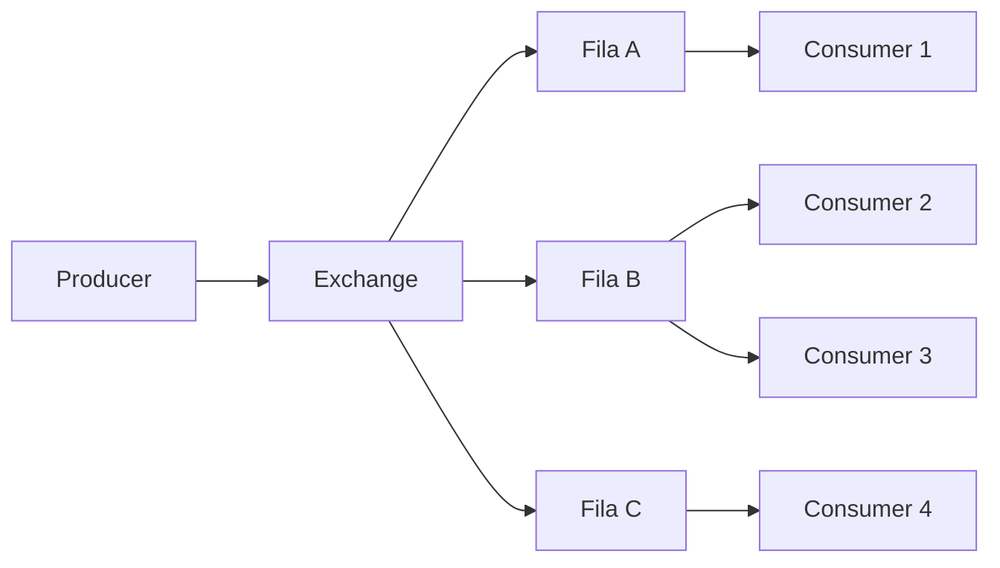
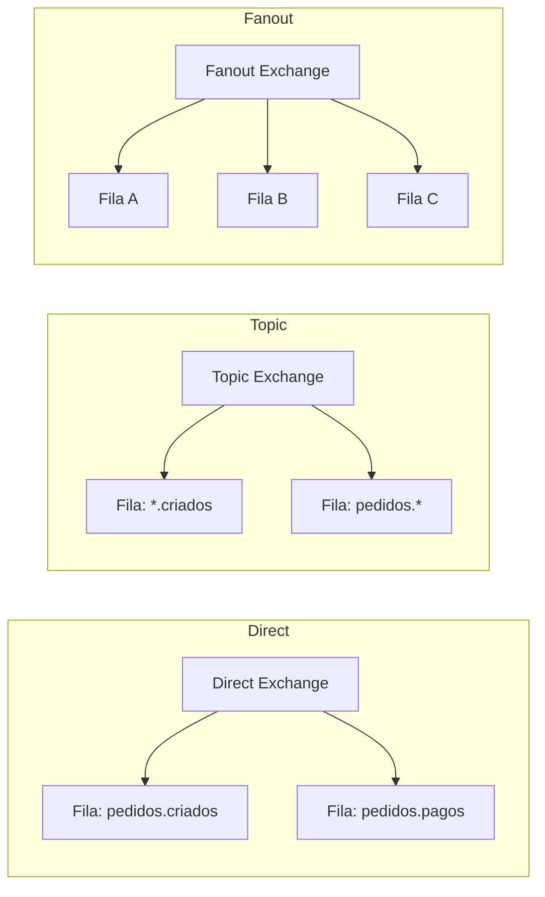

## O que é o RabbitMQ?

RabbitMQ é um message broker open source que implementa o protocolo AMQP (Advanced Message Queuing Protocol). Leve e fácil de configurar, é ideal para comunicação assíncrona entre serviços.

## Modelo de Mensageria



## Tipos de Exchange



| Tipo | Descrição | Routing Key |
|------|-----------|-------------|
| **Direct** | Mensagem vai para fila com routing key exata | `pedidos.criados` |
| **Topic** | Routing key com padrão wildcard (`*`, `#`) | `pedidos.*` |
| **Fanout** | Mensagem vai para todas as filas ligadas | Ignorada |
| **Headers** | Roteamento por cabeçalhos (não routing key) | Ignorada |

## Producer em Java

```java
import com.rabbitmq.client.Channel;
import com.rabbitmq.client.Connection;
import com.rabbitmq.client.ConnectionFactory;
import com.rabbitmq.client.MessageProperties;

public class PedidoPublisher {

    private static final String EXCHANGE_NAME = "pedidos";
    private static final String QUEUE_NAME = "pedidos.novos";

    public static void main(String[] args) throws Exception {
        ConnectionFactory factory = new ConnectionFactory();
        factory.setHost("localhost");
        factory.setUsername("guest");
        factory.setPassword("guest");

        try (Connection conn = factory.newConnection();
             Channel channel = conn.createChannel()) {

            // Declarar exchange do tipo direct
            channel.exchangeDeclare(EXCHANGE_NAME, "direct", true);

            // Declarar fila durável
            channel.queueDeclare(QUEUE_NAME, true, false, false, null);

            // Binding: liga fila à exchange com routing key
            channel.queueBind(QUEUE_NAME, EXCHANGE_NAME, "pedidos.novo");

            String pedido = """
                {"pedidoId": "456", "cliente": "Maria", "total": 899.90}""";

            // Publicar mensagem persistente
            channel.basicPublish(
                EXCHANGE_NAME,
                "pedidos.novo",
                MessageProperties.PERSISTENT_TEXT_PLAIN,
                pedido.getBytes("UTF-8"));

            System.out.println("Pedido publicado: " + pedido);
        }
    }
}
```

## Consumer em Java

```java
import com.rabbitmq.client.*;

public class PedidoConsumer {

    private static final String QUEUE_NAME = "pedidos.novos";

    public static void main(String[] args) throws Exception {
        ConnectionFactory factory = new ConnectionFactory();
        factory.setHost("localhost");

        Connection conn = factory.newConnection();
        Channel channel = conn.createChannel();

        channel.queueDeclare(QUEUE_NAME, true, false, false, null);
        channel.basicQos(1); // Pega uma mensagem por vez

        DeliverCallback callback = (consumerTag, delivery) -> {
            String body = new String(delivery.getBody(), "UTF-8");
            System.out.println("Recebido: " + body);

            try {
                processarPedido(body);
                // Ack manual
                channel.basicAck(delivery.getEnvelope().getDeliveryTag(), false);
            } catch (Exception e) {
                System.err.println("Erro ao processar: " + e.getMessage());
                // Rejeitar e reencaminhar para outra fila (DLQ)
                channel.basicNack(delivery.getEnvelope().getDeliveryTag(),
                    false, false);
            }
        };

        channel.basicConsume(QUEUE_NAME, false, callback, consumerTag -> {});
        System.out.println("Aguardando pedidos...");
    }

    private static void processarPedido(String pedido) {
        System.out.println("Processando pedido: " + pedido);
    }
}
```

## Dead Letter Queue (DLQ)

Configuração para mensagens que falharam:

```java
// Fila principal com dead letter
Map<String, Object> args = new HashMap<>();
args.put("x-dead-letter-exchange", "pedidos.dlx");
args.put("x-dead-letter-routing-key", "pedidos.falhos");
args.put("x-message-ttl", 60000); // 60s de TTL

channel.queueDeclare("pedidos.novos", true, false, false, args);

// DLQ
channel.queueDeclare("pedidos.falhos", true, false, false, null);
channel.queueBind("pedidos.falhos", "pedidos.dlx", "pedidos.falhos");
```

## Publisher Confirms

Garantia que a mensagem chegou ao broker:

```java
channel.confirmSelect();

channel.basicPublish(EXCHANGE_NAME, "pedidos.novo", null, body.getBytes());

if (channel.waitForConfirms()) {
    System.out.println("Mensagem confirmada pelo broker");
} else {
    System.out.println("Falha na confirmação");
}
```

## Casos de Uso

- **Filas de tarefas:** Processamento assíncrono de jobs
- **Notificações:** Envio de e-mails e push notifications
- **Integração entre sistemas:** Bridge entre aplicações legadas
- **RPC assíncrono:** Comunicação request/reply entre serviços
- **Desacoplamento:** Microsserviços se comunicam sem depender diretamente uns dos outros

## Conclusão

RabbitMQ é maduro, estável e fácil de operar. Ideal para equipes que precisam de um message broker confiável com roteamento flexível, sem a complexidade operacional do Kafka.
