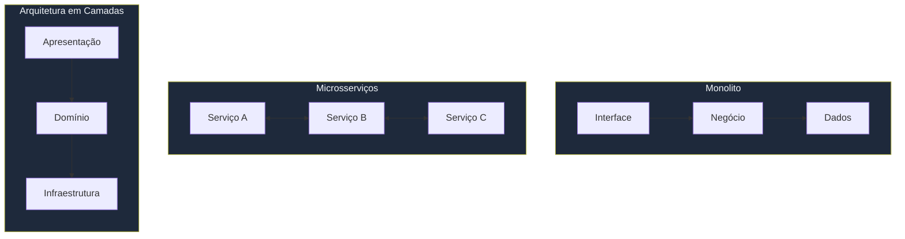

## O que é System Design?

System Design é o processo de definir a arquitetura, componentes, módulos, interfaces e dados de um sistema para satisfazer requisitos específicos. É a ponte entre os requisitos de negócio e a implementação técnica.

## Por que é importante?

Um bom design de sistema determina:

- **Escalabilidade** — capacidade de crescer sob demanda
- **Disponibilidade** — tempo de atividade do sistema
- **Confiabilidade** — capacidade de operar sem falhas
- **Manutenibilidade** — facilidade de evoluir o sistema
- **Custo** — eficiência dos recursos utilizados

## Pilares Fundamentais

### 1. Requisitos

Antes de desenhar qualquer sistema, é essencial levantar:

- **Requisitos funcionais**: o que o sistema deve fazer (ex: criar usuário, processar pagamento)
- **Requisitos não-funcionais**: como o sistema deve se comportar (ex: latência < 200ms, 99.9% de uptime)

### 2. Estimativas de Capacidade

Estimar o volume esperado ajuda a dimensionar o sistema:

```
DAU (Daily Active Users): 10 milhões
Requests por dia: 100 milhões
Requests por segundo (QPS): ~1150
Armazenamento por usuário: 100KB
Armazenamento total/dia: ~1TB
```

### 3. Modelagem de Dados

Definir as entidades, seus atributos e relacionamentos é o primeiro passo técnico. Um bom modelo de dados simplifica consultas e garante consistência.

### 4. Design da Arquitetura

A escolha da arquitetura define como os componentes se comunicam:



- **Monolito**: simplicidade inicial, difícil escalar
- **Microsserviços**: escalabilidade independente, complexidade operacional
- **Arquitetura em Camadas**: separação de responsabilidades

## Fluxo de Trabalho Recomendado


1. Entender e esclarecer os requisitos
2. Estimar a escala esperada
3. Modelar os dados
4. Projetar o data flow (fluxo de dados)
5. Desenhar a arquitetura de alto nível
6. Identificar gargalos e pontos de falha
7. Iterar e refinar

## Conclusão

System Design é uma habilidade essencial para engenheiros de software que desejam construir sistemas robustos e escaláveis. A prática constante com problemas reais é o melhor caminho para o aprendizado.
